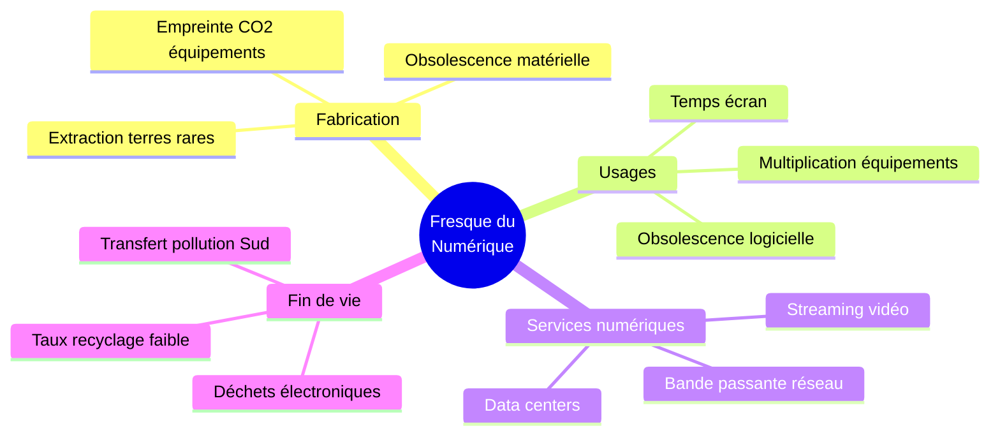
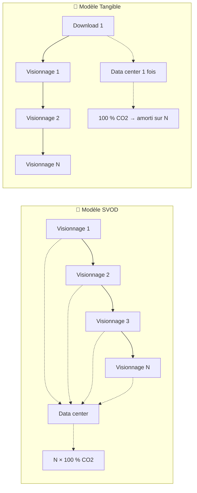
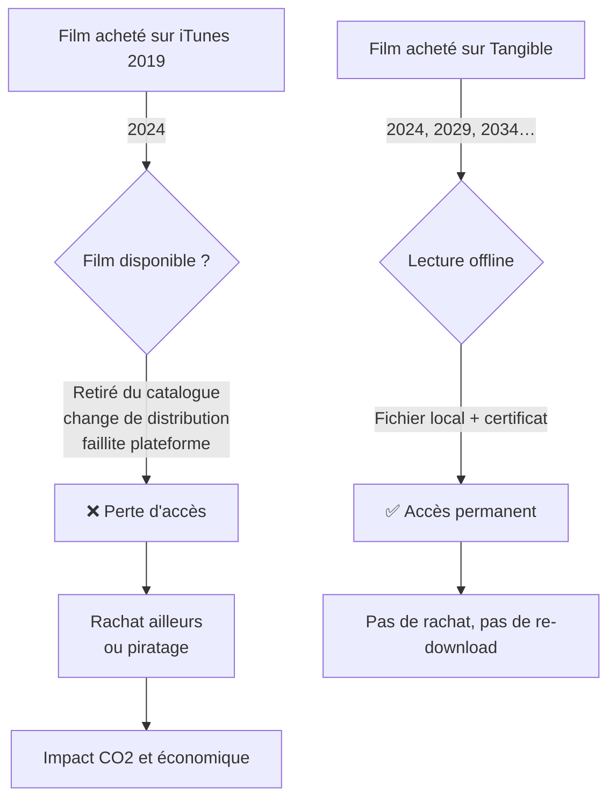
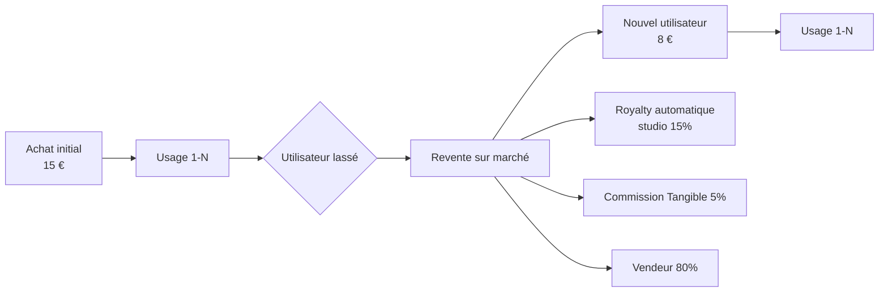

# 🌱 Fresque du Numérique — Mapping Tangible

> [!important] Argument central pour le jury
> Le PDF Scrum'Innov cite explicitement les **axes identifiés lors de la Fresque du numérique**. Ce mapping démontre noir sur blanc **comment Tangible y répond**.

## 🧭 Les 4 grands axes de la Fresque

La **vidéo représente ~80 % du trafic internet mondial** (Sandvine 2024) et la **SVOD à elle seule ~1 % des émissions mondiales de GES** (The Shift Project 2023). C'est le premier levier d'impact du numérique grand public.

## 🗺️ Mapping Tangible ↔ Fresque

| Axe Fresque | Impact Tangible | Mécanisme |
|-------------|:---------------:|-----------|
| **Fabrication** | ↘️ moyen | Oriente vers l'usage prolongé plutôt que le renouvellement d'appareils streaming |
| **Usages / obsolescence** | ↘️↘️ **fort** | Lutte contre l'obsolescence logicielle des contenus (retraits plateformes) |
| **Services numériques** | ↘️↘️↘️ **très fort** | Téléchargement **unique** vs re-streaming répété |
| **Fin de vie** | ↘️ faible | Indirect — incite à moins changer de matériel |

### Légende
- ↘️ = impact réducteur faible
- ↘️↘️ = impact réducteur fort
- ↘️↘️↘️ = impact réducteur très fort

## 🔥 Pilier 1 — Services numériques : streaming vs téléchargement

### Chiffre clé — estimation (cas film 4K, 8 Go)

| Métrique | SVOD (5 visionnages) | Tangible (5 visionnages) |
|----------|---------------------:|-------------------------:|
| Transferts réseau | 5 × 8 Go = **40 Go** | 1 × 8 Go = **8 Go** |
| Énergie data center + réseau | ~5 × 1,0 kWh = **5 kWh** | ~1 × 1,0 kWh + 0 = **1 kWh** |
| Émissions estimées (mix UE ~60 gCO2/kWh) | **~300 gCO2** | **~60 gCO2** |
| **Réduction Tangible** | — | **−80 %** |

> [!note]
> Les chiffres sont des estimations pédagogiques basées sur les ordres de grandeur The Shift Project / ARCEP. Bilan CO2 précis à publier annuellement par Tangible → [[Idées en vrac#🌱 Numérique responsable]].

## 🛑 Pilier 2 — Obsolescence programmée des contenus

### Exemples documentés
- **Microsoft Movies & TV** — arrêt des ventes 2021, bibliothèques gelées
- **Disney+** — retrait de ~50 titres en 2023 (Willow, Crater…)
- **HBO Max / Max** — suppression de Westworld S4 (2022)
- **iTunes** — bibliothèques régionalement bloquées après déménagement

## ♻️ Pilier 3 — Économie circulaire numérique

Le **marché secondaire Tangible** transforme une licence figée en objet **réutilisable économiquement**. Unique dans l'écosystème numérique vidéo.

### Effets
- **Économique** : l'utilisateur récupère ~50 % de sa mise
- **Écologique** : même fichier chiffré, zéro téléversement supplémentaire
- **Équité** : l'ayant-droit touche une royalty sur chaque revente (inédit)

## 🌐 Pilier 4 — Souveraineté numérique

| Axe souveraineté | Concurrence | Tangible |
|------------------|-------------|----------|
| Siège / juridiction | Californie (GAFAM) | France / UE |
| DRM | Propriétaire (FairPlay, Widevine) | Open standards cryptographiques |
| Données users | Profilées, exploitées | Minimales, pas de profilage |
| Portabilité | Impossible | Certificats open-spec → lecteur alternatif |
| Revente | Interdite | Permise avec royalties |

**Cadre européen favorable** : RGPD, Digital Markets Act (DMA), Data Act — tous poussent vers plus de portabilité et d'interopérabilité, dans le sens Tangible.

## 📊 Indicateurs RSE à publier annuellement

Tangible s'engage à publier chaque année un **rapport d'impact transparent** :

| Indicateur | Cible Y3 |
|------------|----------|
| GHG Scope 1+2+3 par utilisateur actif | < 3 kgCO2/an |
| Ratio P2P/CDN (efficacité distribution) | > 70 % via P2P |
| % de films indépendants dans le catalogue | > 40 % |
| Montant de royalties reversé aux ayants droit | Publié mensuellement |
| % de code open source (Player) | 100 % (Player), ~30 % (Store) |
| Audit sécurité externe | 1 / an minimum |
| % de femmes dans l'équipe | ≥ 40 % cible |

## 🎤 À utiliser dans le pitch

> [!tip] Slide 11 ou 12 du pitch
> « Tangible, c'est aussi **trois gestes numériques responsables** :
> 1️⃣ Télécharger une fois au lieu de streamer dix.
> 2️⃣ Acheter une fois pour garder vingt ans.
> 3️⃣ Revendre plutôt que jeter. »

## 🔗 Liens

- [[Tangible - Description#🌱 Angle numérique responsable]]
- [[Étude de Marché]] · [[SWOT]]
- [[Script Pitch 7min]] · [[Plan du PowerPoint]]
- [[MOC]]
