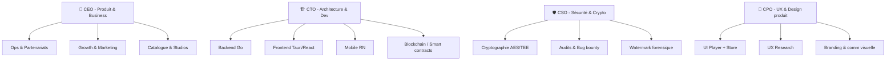
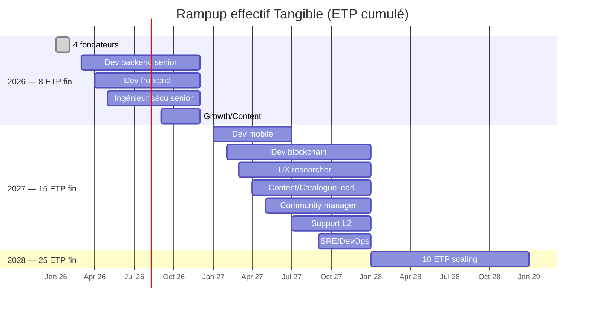

# 👥 Équipe Tangible

> [!info]
> Composition de l'équipe fondatrice (créathlon Scrum'Innov → startup) et plan de recrutement sur 24 mois.

## 🧭 Philosophie de composition

- **Multi-compétences des 3 parcours BUT Informatique** (Dev & Applications, Données, Admin Système & Réseaux)
- **Co-fondateurs complémentaires** : 1 CEO produit/business + 1 CTO architecture + 1 CPO UX ou 1 lead sécurité
- **Advisors externes** : cinéma (producteur indé), crypto (expert audit), juridique (IP numérique)

## 🎭 Organigramme fondateur (cible amorçage)

## 🧑‍💻 Fondateurs (profils à pourvoir — 4 rôles)

### 🧭 CEO — Produit & Business
- **Mission** : vision, levée, partenariats studios, recrutement
- **Profil BUT3** : parcours Dev & Apps + appétence business / sensibilité cinéphile
- **Equity indicative** : 28–32 %

### 🏗️ CTO — Architecture & Dev
- **Mission** : stack, archi, qualité code, recrutement technique
- **Profil BUT3** : Dev & Apps / Admin Systèmes → solide en Go/Rust, clean archi, Linux
- **Equity indicative** : 28–32 %

### 🛡️ CSO — Sécurité & Cryptographie
- **Mission** : conception des 5 couches sécurité, audits, bug bounty, conformité
- **Profil BUT3** : Admin Systèmes & Réseaux / passion crypto + TEE + blockchain
- **Equity indicative** : 18–22 %
- **Criticité** : différenciation technique = argument central du pitch

### 🎨 CPO — UX & Design produit
- **Mission** : UX Player+Store, design system, cohérence expérience, tests users
- **Profil BUT3** : Données ou Dev avec sensibilité design/produit
- **Equity indicative** : 14–18 %

> Équity pool salariés : **10 %** (BSPCE sur 4 ans + cliff 1 an)

## 📋 Responsabilités détaillées

| Domaine | Lead | Contributeurs |
|---------|------|---------------|
| Vision & stratégie | CEO | Tous (comité mensuel) |
| Levée & relations investisseurs | CEO | CTO (due diligence tech) |
| Partenariats studios | CEO | Advisor cinéma |
| Architecture & tech | CTO | CSO |
| Sécurité & audits | CSO | CTO |
| UX & produit | CPO | CEO |
| Catalogue & curation | CEO → Content Lead Y2 | CPO (présentation) |
| Growth & marketing | CEO → Growth Lead Y2 | CPO (creatives) |
| Support & communauté | CPO → Community Mgr Y2 | Tous |
| Juridique / IP | Avocat externe | CEO |

## 📅 Plan de recrutement 3 ans

### Détail des embauches

| Trimestre | Nouvelles embauches | Effectif cumulé |
|-----------|---------------------|-----------------|
| T1 2026 | 4 fondateurs | **4** |
| T2 2026 | +1 dev backend, +1 dev frontend, +1 ingé sécu | **7** |
| T4 2026 | +1 growth/content | **8** |
| T1 2027 | +1 mobile, +1 blockchain, +1 UX | **11** |
| T2 2027 | +1 content lead, +1 community, +1 support | **14** |
| T3 2027 | +1 SRE/DevOps | **15** |
| 2028 | +10 (international, B2B, ops, support) | **25** |

## 🎓 Advisors (rôles non rémunérés ou equity 0,25–1 %)

| Advisor | Profil cible | Apport |
|---------|--------------|--------|
| 🎬 Advisor cinéma | Producteur indé (mk2, ARP, Gaumont classics) | Relations studios, compréhension droits |
| 🔐 Advisor crypto/sécu | Ex-ANSSI / chercheur TEE | Revue archi sécurité, crédibilité |
| ⚖️ Advisor juridique | Avocat IP numérique (ex-Bird & Bird, Osborne Clarke) | Montage contractuel revente |
| 💰 Advisor finance | Ex-VC early stage (Elaia, Partech Seed) | Préparation levées |
| 🎯 Advisor growth | Ex-CMO plateforme culturelle (Deezer, Molotov) | Go-to-market cinéphile |

## 🏛️ Gouvernance

- **Conseil des fondateurs** : 4 personnes, décisions unanimes sur orientations majeures
- **Comité de direction hebdomadaire** : fondateurs + leads fonctions (Y2+)
- **Board post-Série A** : 3 fondateurs + 1-2 investisseurs + 1 indépendant
- **Pacte d'associés** : vesting 4 ans (cliff 12 mois), good/bad leaver, drag-along

## 💰 Rémunération fondateurs

- **Années 1–2** : salaire minimal (SMIC+ / charges à périmètre startup) + BSPCE
- **Année 3+** : remontée progressive vers marché startup (~70-80% du marché)
- **Vesting** : 48 mois avec cliff 12 mois pour tous les fondateurs

## 🌱 Culture & valeurs

| Valeur | Traduction concrète |
|--------|---------------------|
| **Honnêteté** | Pas de marketing superlatif, transparence prix, open-source du player |
| **Responsabilité** | Bilan CO2 annuel, code open source audité |
| **Propriété** | Les users possèdent vraiment leurs achats ; les salariés possèdent vraiment (BSPCE) |
| **Cinéma d'abord** | Jamais de compromis qualité image/son ; curation soignée |
| **Rigueur technique** | Tests, audits, pas de debt cachée |

## 🔗 Liens

- [[Tangible - Description]] · [[Roadmap Technique]] · [[Hypothèses Financières]]
- [[Cases 2 - Activités Partenaires Ressources Canaux]]
- [[MOC]]
