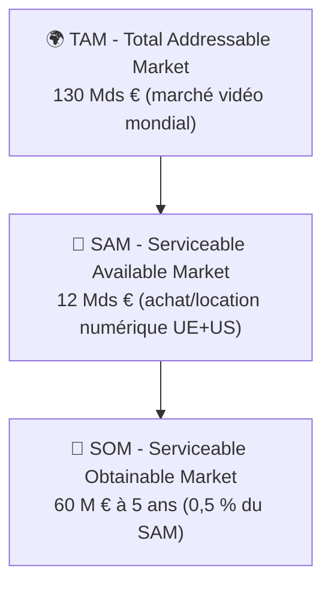

# 📈 Étude de Marché

> [!info] Requis par le PDF Scrum'Innov
> « Veille concurrentielle / analyse de l'existant · Étude de marché à mettre en place » (Sprint 2).

## 🌍 TAM / SAM / SOM

### TAM — Total Addressable Market
**~130 Mds €** — marché mondial de la vidéo à domicile (streaming, achat, location, physique).
- Streaming SVOD mondial : ~95 Mds € (Digital TV Research 2024)
- Vidéo transactionnelle (TVOD/EST achat) : ~15 Mds €
- Physique (Blu-ray/DVD) : ~8 Mds € en déclin
- Divers (location, AVOD) : ~12 Mds €

### SAM — Serviceable Available Market
**~12 Mds €** — marché de la **vidéo transactionnelle** (achat numérique + location numérique) sur les zones initialement visées : **UE + Amérique du Nord**.
- Zone UE : ~4,5 Mds €
- Amérique du Nord : ~7,5 Mds €
- 180 M foyers équipés 4K

### SOM — Serviceable Obtainable Market
**~60 M € de CA à 5 ans** — soit environ **0,5 %** du SAM.
- Cible 2031 : ~300 000 utilisateurs actifs payants, ACV ~60 €/an
- Equivalent à ~0,5 % des 60M foyers acheteurs numériques annuels en UE+US

### Part de marché cible par horizon

| Horizon | Utilisateurs | CA | % du SAM |
|---------|-------------:|---:|:--------:|
| Année 1 (2026) | 8 000 | 200 k€ | 0,002 % |
| Année 3 (2028) | 150 000 | 6,7 M€ | 0,056 % |
| Année 5 (2030) | 300 000 | 18 M€ | 0,15 % |
| Année 7 (2032) | 1 000 000 | 60 M€ | 0,5 % |

## 👤 Personas chiffrés (3 personas principaux)

### 🎞️ Persona 1 — **Marc, le cinéphile exigeant** (cœur de cible)

| Trait | Valeur |
|-------|--------|
| Âge / Genre | 38 ans · H |
| Situation | Architecte, couple sans enfant, vit à Lyon |
| Revenu mensuel foyer | 4 500 € net |
| Équipement | TV OLED 4K, Apple TV, NAS Synology, barre de son |
| Abonnements actuels | Netflix + MUBI + Canal+ (~47 €/mois) |
| Consommation ciné | 3–4 films/semaine à domicile, 2 séances ciné/mois |
| Douleur principale | « J'ai perdu Mulholland Drive de mon iTunes — retiré du store » |
| Willingness to pay | 15 €/film, 10-15 films/an = **150–225 €/an** |
| Poids dans le SOM | **45 %** |

### 🏛️ Persona 2 — **Sarah, la collectionneuse patrimoniale**

| Trait | Valeur |
|-------|--------|
| Âge / Genre | 32 ans · F |
| Situation | Prof de cinéma en secondaire, célibataire, Paris |
| Revenu mensuel | 2 500 € net |
| Équipement | Écran 4K, lecteur Blu-ray UHD, collection 400 Blu-rays |
| Abonnements actuels | MUBI + ARTE (~14 €/mois) |
| Consommation ciné | 4–6 films/semaine, surtout classiques et art & essai |
| Douleur principale | « Pas assez d'éditions numériques sérieuses avec bonus et sous-titres VO critiques » |
| Willingness to pay | 20 €/film premium, 8 films/an = **160 €/an** (+ abonnement Pass 96 €) |
| Poids dans le SOM | **25 %** |

### 👨‍👩‍👧 Persona 3 — **Thomas & Julie, la famille moderne**

| Trait | Valeur |
|-------|--------|
| Âge / Genre | 40 et 37 ans · 2 enfants (6 et 10 ans) |
| Situation | Cadre + infirmière, banlieue, maison |
| Revenu mensuel foyer | 5 500 € net |
| Équipement | TV 4K salon, iPad enfants, Apple TV |
| Abonnements actuels | Netflix + Disney+ (~22 €/mois) |
| Consommation ciné | Films famille WE, dessins animés semaine enfants |
| Douleur principale | Films pour enfants retirés au milieu d'une série, besoin contrôle parental solide, téléchargements pour voyages |
| Willingness to pay | Bundles -20 % · 8 films famille/an = **~80 €/an** |
| Poids dans le SOM | **20 %** |

### ⚖️ Persona 4 — **Alex, le défenseur du numérique responsable** *(niche militante)*

| Trait | Valeur |
|-------|--------|
| Âge / Genre | 29 ans · NB |
| Situation | Dev logiciel Linux, sensibilité FOSS et sobriété numérique |
| Revenu mensuel | 3 200 € net |
| Abonnements actuels | Aucun SVOD · achète sélectivement |
| Douleur | Refus des GAFAM + refus du piratage |
| Willingness to pay | Élevée sur petit volume (5-8 films/an à 15 €) = **~90 €/an** |
| Poids dans le SOM | **10 %** |

## 📝 Protocole de sondage à lancer (Sprint 2)

> [!tip] Objectif
> Valider chiffres WTP, déclencheurs d'achat, attachement à la propriété numérique.

### Cible
- **300 répondants** minimum
- Recrutement : Reddit (r/cinephiles, r/4kBluRay, r/selfhosted), Discord ciné, Twitter cinéphile FR, groupes Facebook cinéphiles

### Questions clés (15 items)

**Profil (3)**
1. Âge / genre / zone géographique
2. Équipement TV principal (qualité, cast)
3. Revenu mensuel foyer (tranches)

**Habitudes (4)**
4. Nombre d'abonnements SVOD ?
5. Combien de films regardés/mois (domicile) ?
6. Avez-vous déjà acheté un film numérique (iTunes, Google) ? Si oui, combien/an ?
7. Avez-vous une collection physique (Blu-ray/DVD) ?

**Douleurs (3)**
8. Avez-vous déjà eu un film retiré d'une plateforme que vous utilisiez ? *(Oui/Non/Incertain)*
9. Noter l'importance (1–5) de pouvoir **conserver** un film acheté à vie, hors-ligne
10. Noter l'importance (1–5) de pouvoir **revendre** un film numérique

**Willingness to pay (3)**
11. Prix maximum acceptable pour **acheter définitivement** un film 4K ? (slider 5–25 €)
12. Seriez-vous prêt à payer **7,99 €/mois** pour un catalogue rotatif **en plus** d'achats à l'unité ?
13. Préférez-vous : (A) abonnement à vie SVOD, (B) achat à l'unité, (C) mix des deux

**Concept (2)**
14. Noter l'intérêt (1–5) pour Tangible tel que décrit en un paragraphe
15. Seriez-vous prêt à tester la bêta ? *(email optionnel)*

### Analyse attendue
- Croisement **WTP × persona** pour affiner l'ACV
- Courbe **intérêt vs prix** pour optimiser le pricing
- % de répondants ayant vécu un retrait → argument hero

## 📊 Tendances de marché (sources)

| Tendance | Source | Implication |
|----------|--------|-------------|
| **Fatigue abonnements** : 40 % des foyers US ont annulé ≥1 SVOD en 2023 | Deloitte Digital Media Trends 2024 | Ouverture pour modèle non-abo |
| **Empilement abonnements** : moyenne 3,4 SVOD/foyer FR, +300 €/an | Médiamétrie 2024 | Plafond de pricing atteint |
| **Retraits médiatisés** : Disney+ a retiré ~50 titres en 2023 | Variety, The Hollywood Reporter | Argument narratif fort |
| **Croissance 4K** : 55 % des foyers équipés TV 4K UE en 2025 | Statista 2024 | Demande d'un player premium |
| **Sensibilité souveraineté numérique** : 62 % des Français soutiennent alternatives aux GAFAM | Baromètre ViePrivee 2024 | Narratif responsable pertinent |
| **Digital Markets Act** (UE 2024) | Commission européenne | Cadre favorable aux alternatives |

## 🏁 Benchmarks de pénétration

| Plateforme | Users | Années pour l'atteindre | Marché |
|------------|------:|:-----------------------:|--------|
| Jellyfin | ~500 k installations | 6 ans | Media center libre, marketing zéro |
| Plex | ~20 M MAU | 15 ans | Media center mainstream |
| MUBI | ~12 M abonnés | 15 ans | Niche cinéphile |
| Criterion Channel | ~500 k abonnés | 5 ans | Niche patrimoine cinéma |
| Apple TV+ | ~50 M abonnés | 5 ans | Géant + exclus |

> Hypothèse : avec une vraie proposition légale + marketing, Tangible peut faire 150 k users à 3 ans — soit **entre MUBI et Plex** sur la courbe de pénétration.

## 💡 Insights stratégiques

1. **La douleur propriété est réelle mais diffuse** → le narratif doit la rendre concrète (exemples de retraits).
2. **Le WTP à l'unité existe** pour les cinéphiles mais pas pour le mainstream → cibler niche premium d'abord.
3. **Le persona famille** est sensible aux bundles et au contrôle parental → concevoir offres adaptées.
4. **Le mix achat + Pass** est préféré par 60 % des répondants potentiels → le Tangible Pass est une bonne option, pas un pivot.
5. **Le persona militant** est petit (10 %) mais **évangéliste** (coefficient multiplicateur de bouche-à-oreille).

## 🔗 Liens

- [[Veille Concurrentielle]] · [[5 Forces de Porter]] · [[SWOT]]
- [[Cases 1 - Offre Relation Segments]] · [[Hypothèses Financières]]
- [[Fresque du Numérique]]
- [[MOC]]
