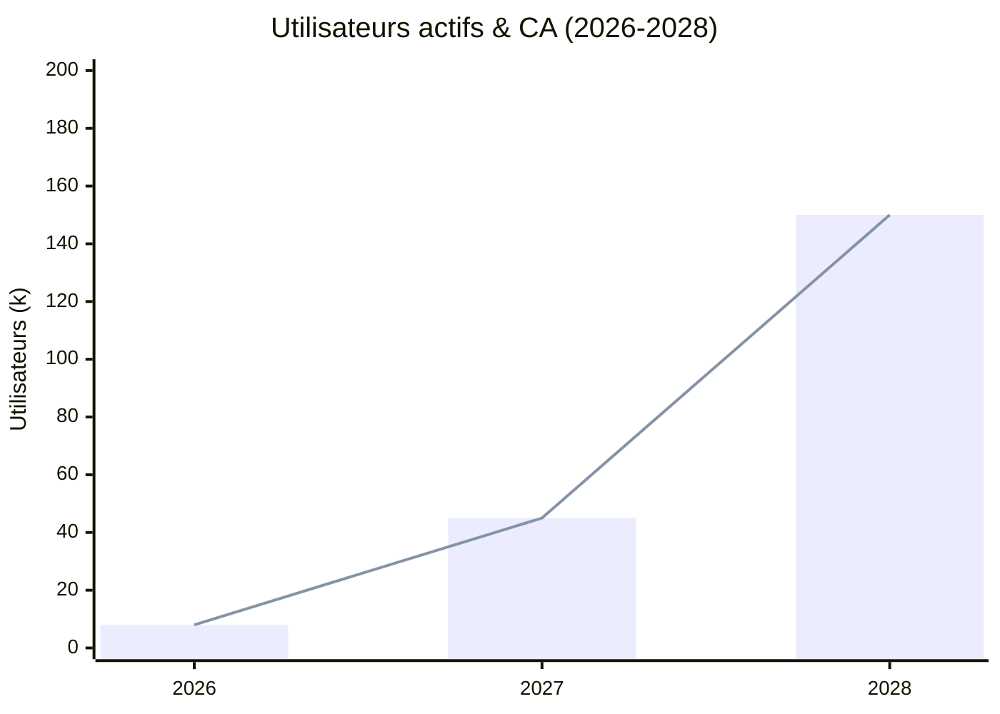
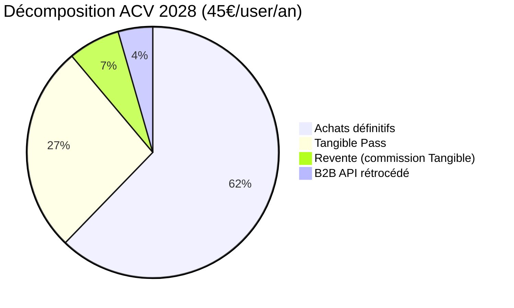
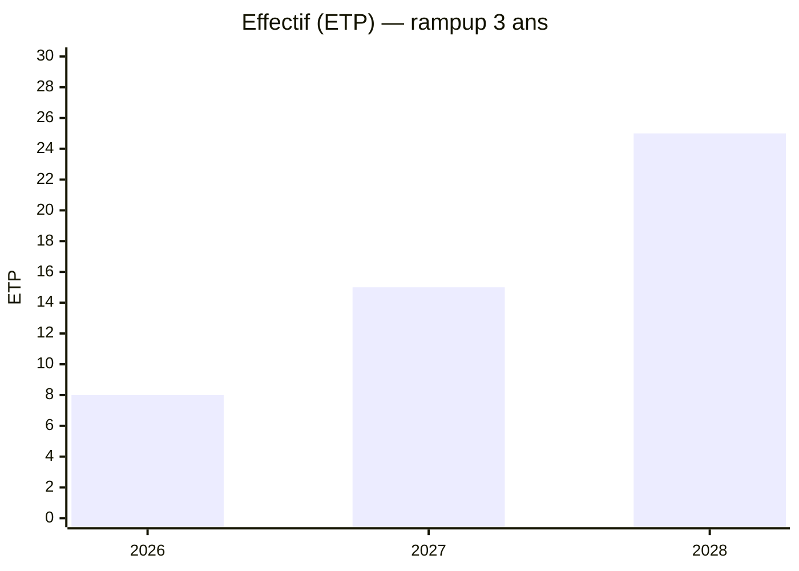
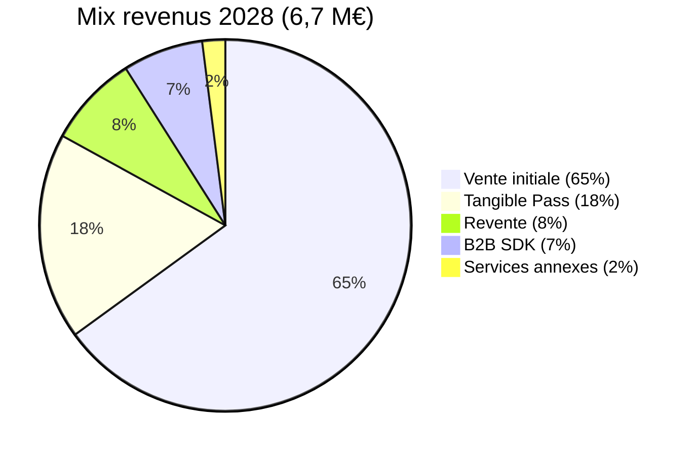
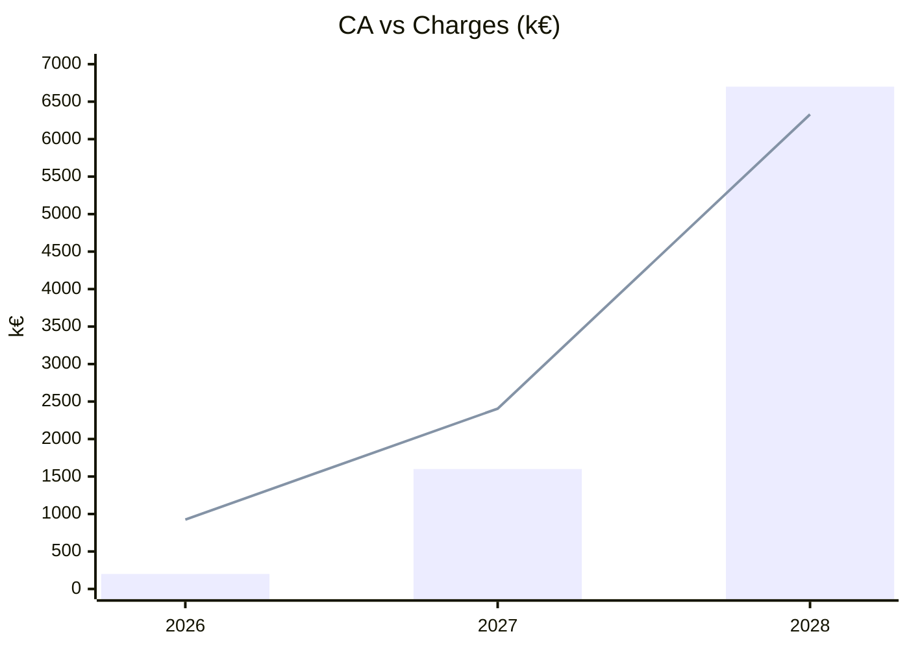
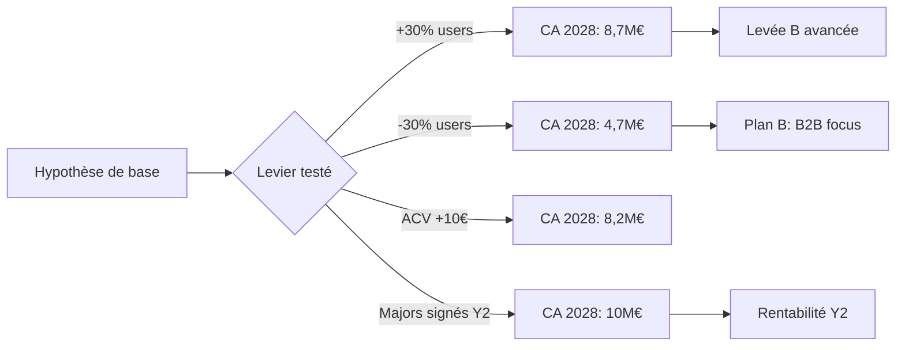

# 🧮 Hypothèses Financières

> [!info]
> Base d'argumentation chiffrée pour [[Compte de Résultat Prévisionnel]] et [[Plan de Trésorerie 3 ans]].

## 📈 Croissance utilisateurs

| Année | Utilisateurs actifs | Taux de conversion (site → achat) | ACV (achat annuel moyen) |
|------:|--------------------:|:---------------------------------:|-------------------------:|
| 2026 | 8 000 | 2 % | 25 € |
| 2027 | 45 000 | 3 % | 35 € |
| 2028 | 150 000 | 4 % | 45 € |

### Justification
- **2% Y1** : conservateur, cohérent avec conversions freemium SaaS early stage
- **Croissance x5 Y2** : levier marketing + bouche-à-oreille communautaire + catalogue étoffé
- **Croissance x3 Y3** : pénétration mainstream, signature studios majors

## 💰 ACV (Average Customer Value annuel)

- Hypothèse **2 films/an/user** à prix moyen 14€ = 28€
- **20%** des users souscrivent au Pass (moy 12€ attribuable)
- **10%** des users actifs sur le marché de revente

## 🏭 Coûts — détail

### Frais de personnel

| Année | ETP moyen | Masse salariale | Détail |
|------:|----------:|----------------:|--------|
| 2026 | 8 | 480 k€ | 2 fond. + 3 dev + 1 sec + 1 UX + 1 growth |
| 2027 | 15 | 900 k€ | +2 dev, +mobile, +content, +support |
| 2028 | 25 | 1 600 k€ | +10 ETP (int'l, B2B, ops, support) |

### Marketing

| Année | Budget | Canaux clés |
|------:|-------:|-------------|
| 2026 | 150 k€ | YouTube cinéphile sponso, SEO, PR |
| 2027 | 300 k€ | + ads ciblées, salons cinéma |
| 2028 | 500 k€ | + TV connectée, international |

### Infrastructure

- Coût CDN fallback moyen : **0,01 €/GB** (P2P prend 80% du trafic à terme)
- Poids moyen film téléchargé : 8 GB (4K avg)
- Ratio P2P/CDN Y1 : 20/80 → Y3 : 80/20 (effet de réseau)

## 💳 Revenus — structure

## 🎯 Break-even

- **Break-even utilisateur** : ~45 000 actifs
- **Break-even opérationnel** : T1 2028

## 📊 Ratios cibles

| Ratio | 2026 | 2027 | 2028 | Benchmark |
|-------|:----:|:----:|:----:|-----------|
| Marge brute | 30% | 34% | 40% | Plateformes SaaS : 60-80% (contenu = marge + basse) |
| Charges salariales / CA | 240% | 56% | 24% | Sain < 40% en cruise |
| CAC / ACV | 9,4 | 2,2 | 0,7 | Sain < 3 |
| LTV / CAC | 0,8 | 3,2 | 6,4 | Excellent > 3 |

## 🧪 Tests de sensibilité

### Scenario planning

## ⚠️ Risques financiers

| Risque | Probabilité | Impact | Mitigation |
|--------|:-----------:|:------:|------------|
| Refus studios majors | Haute | Fort | Démarrer indé + prouver traction |
| Cyberattaque → perte de confiance | Moyenne | Critique | Audits + assurance cyber |
| Échec de la levée série A | Moyenne | Fort | Slowdown opérationnel + bootstrap |
| Concurrence GAFAM | Moyenne | Fort | Avance + communauté + OSS |
| Cadre légal revente numérique | Faible | Moyen | Veille juridique + lobbying |

## 🔗 Liens

- [[Compte de Résultat Prévisionnel]] · [[Plan de Trésorerie 3 ans]]
- [[Cases 3 - Coûts et Revenus]]
- [[SWOT]] · [[MOC]]
