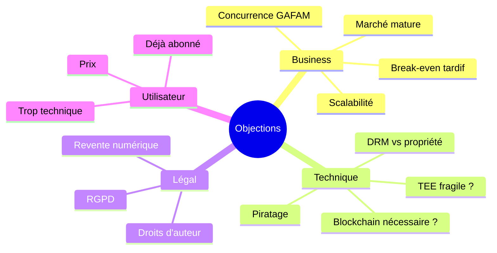

# 🛡️ Objections anticipées & Réponses

> [!tip] Usage
> Préparer les **20 questions les plus probables** du jury pour ne jamais être pris au dépourvu.
> Garder chaque réponse ≤ **30 secondes**.

## 🥊 Catégories d'objections

## 💼 Objections Business

### ❓ Q1 — « Apple ou Google peuvent vous copier en 6 mois. »
> **R** : C'est possible. Mais ils ne le feront pas, parce que leur modèle est le verrou écosystème. Leur intérêt est de ne **pas** permettre la revente ni la portabilité. Notre avantage n'est pas purement technique, c'est **culturel et communautaire** : un player open source, une communauté militante, des licences exclusives indépendants. La vraie menace serait un nouvel entrant — et là, notre avance + réseau sont une barrière.

### ❓ Q2 — « Le marché est saturé par Netflix & co. »
> **R** : Le marché du **streaming** est saturé. Celui de la **propriété numérique réelle**, personne n'y est. iTunes prétend y être mais sa propriété est fictive. On ne concurrence pas Netflix, on crée un nouveau segment à côté.

### ❓ Q3 — « Break-even en Année 3, c'est long. »
> **R** : C'est la norme pour une plateforme de contenu. Netflix a mis 7 ans. Spotify 10. Nous visons 3 ans parce que notre modèle mixte (vente + pass + revente + B2B) diversifie les revenus et que nous démarrons avec des studios indépendants qui acceptent nos conditions. Avec des milestones clairs de dé-risquage à 18 mois.

### ❓ Q4 — « Vous tablez sur 150k users en 3 ans — c'est optimiste. »
> **R** : 150 000, c'est 0,2% du marché français. Jellyfin fait 500k installations sans marketing. Plex 20M. Notre hypothèse est qu'avec une vraie proposition légale + marketing ciblé, on dépasse Jellyfin sans atteindre Plex. Argumentaire conservateur.

## 🔧 Objections Techniques

### ❓ Q5 — « Le DRM est anti-utilisateur, non ? »
> **R** : Oui, les DRM classiques — FairPlay, Widevine — le sont, parce qu'ils empêchent la lecture offline, la copie de sauvegarde, le changement d'OS. Notre approche est différente : le chiffrement protège la **propriété** (pas la lecture conditionnelle). L'utilisateur peut copier son fichier, il reste inutilisable sans le certificat qui, lui, est à lui. C'est un **DRM inversé** : il protège *l'utilisateur contre Tangible*.

### ❓ Q6 — « Votre TEE et watermark suffiront-ils contre le piratage ? »
> **R** : Aucun système n'est inviolable. Mais le watermark frame-level permet de tracer la **licence source** d'une fuite et d'ouvrir une procédure légale. Même iTunes a été piraté. Notre but n'est pas l'étanchéité totale mais la **responsabilisation** + le **compromis raisonnable**. Et pour les studios, c'est aujourd'hui ce qui existe de plus solide avec des audits à l'appui.

### ❓ Q7 — « Blockchain, c'est pas juste un buzz ? »
> **R** : Ici c'est technique, pas marketing. On a besoin de trois propriétés : **preuve de propriété vérifiable offline**, **transferts programmables avec splits automatiques (revente)**, **indépendance vis-à-vis de Tangible si on ferme**. Une base de données centrale ne satisfait aucune des trois. Polygon L2 coûte < 1 centime par transaction — c'est viable économiquement.

### ❓ Q8 — « Intel SGX a eu plein de failles. »
> **R** : Exact. C'est pour ça qu'on a une défense en profondeur (5 couches) et qu'on suit les CVE de près. Pour mobile, ARM TrustZone a un meilleur historique. Dans tous les cas, même si la TEE tombe, il reste le watermark forensique pour la traçabilité. C'est un jeu de coûts : on relève la barrière, on ne la rend pas infranchissable.

## ⚖️ Objections Légales

### ❓ Q9 — « La revente de fichiers numériques, c'est légal ? »
> **R** : C'est la question. En UE, l'arrêt **UsedSoft (CJUE 2012)** a validé la revente de licences logicielles. Pour les films, c'est plus ambigu. Nous nous alignons avec les studios : **ils touchent 15%** de chaque revente, donc ils ont intérêt à accepter. Notre montage contractuel transforme la licence en « droit d'usage transférable contractuellement ». On travaille avec un cabinet IP pour sécuriser.

### ❓ Q10 — « Et côté RGPD ? »
> **R** : Design privacy-by-default : pas de profilage, pas de pub, connexion biométrique sans mot de passe. Les certificats utilisent des clés pseudonymes (pas l'identité civile). Minimisation des données : on ne stocke que le strict nécessaire pour la vente et le support.

## 👤 Objections Utilisateur

### ❓ Q11 — « 15 € pour un film, c'est cher vs. Netflix. »
> **R** : Netflix c'est 18 €/mois, un film que vous ne possédez pas. Tangible c'est 15 € **une fois**, pour un film que vous gardez à vie et que vous pouvez revendre 8 €. Le « coût net » peut être de 7 €. Et pour les utilisateurs qui regardent leurs films plusieurs fois, c'est rentabilisé en 2-3 visionnages.

### ❓ Q12 — « C'est trop technique pour le grand public. »
> **R** : Côté utilisateur, acheter un film sur Tangible = 2 clics, comme iTunes. La cryptographie, la blockchain, tout ça est **invisible**. On vend de la propriété simple : « votre film reste à vous, même si on disparaît demain ». Le pitch est émotionnel, la tech reste sous le capot.

### ❓ Q13 — « J'ai déjà 4 abonnements, je veux pas en rajouter. »
> **R** : C'est justement le point : Tangible **n'est pas un abonnement**. On achète un film, puis un autre quand on en a envie. Le Pass est **optionnel**. C'est l'opposé de l'empilement SVOD.

## 🧪 Objections Modèle

### ❓ Q14 — « Pourquoi les studios accepteraient vs. Netflix ? »
> **R** : Netflix prend 100% du deal en exclusivité. Nous prenons 20% de commission, ils gardent 70%, et ils touchent **des royalties sur les reventes** (15%) — ce qu'aucune plateforme ne leur offre. Pour les studios indé sans négociation majeure possible avec Netflix, c'est même leur **seul canal pérenne de vente à l'unité**. Pour les majors, c'est un relais complémentaire.

### ❓ Q15 — « Vous serez incapables de signer une major. »
> **R** : Pas en Phase 1, et c'est assumé. La stratégie est de prouver la traction avec les indé d'abord, puis négocier les majors avec 50 000 utilisateurs prouvés. C'est exactement ce que Netflix a fait : série indé, puis *House of Cards*, puis tout.

### ❓ Q16 — « Et si Tangible disparaît ? »
> **R** : La question qui tue nos concurrents, justement. Chez nous, l'utilisateur garde : son fichier chiffré local, son certificat on-chain (indépendant), sa clé biométrique locale. Si Tangible ferme, un **lecteur tiers open source** peut lire les fichiers grâce à la spec publique. C'est intégré par design.

## 🌱 Objections Numérique Responsable

### ❓ Q17 — « Blockchain = énergivore, c'est pas responsable. »
> **R** : Bitcoin oui. Polygon PoS, non — c'est du Proof of Stake, ~99,9% plus efficient que Bitcoin PoW. L'empreinte d'un certificat tient dans une requête DNS. Et surtout, on compare ça à **10 re-streamings du même film** qui consomment des GB de bande passante à chaque fois. Un téléchargement unique + lectures locales = bilan CO2 fortement inférieur.

### ❓ Q18 — « C'est du greenwashing. »
> **R** : On ne prétend pas « sauver la planète ». On dit : *moins de re-streaming répétitif, moins de location déguisée, plus de longévité numérique*. Des effets mesurables, pas un slogan. Et c'est vérifiable : bilan CO2 par film visionné, qu'on publiera.

## 🎯 Objections Équipe

### ❓ Q19 — « Vous êtes étudiants, pas une vraie équipe. »
> **R** : Exact, et c'est l'étape zéro. On vise un incubateur (STATION F / BIC Montpellier) post-diplôme, une équipe fondatrice de 3-4, et des conseillers seniors (experts cinéma + crypto). La levée seed servira à recruter la maturité technique manquante : un ingénieur sécurité senior, un content director catalogue.

### ❓ Q20 — « Pourquoi vous ? »
> **R** : Parce qu'on combine les 3 parcours BUT Informatique — dev, données, admin système. Parce qu'on est des utilisateurs frustrés (notre vécu = notre produit). Parce qu'on a choisi le challenge le plus dur — construire une infrastructure technique propriétaire + un modèle légal nouveau — et qu'on préfère tenter ça plutôt qu'encore une app CRUD.

## 🔗 Liens

- [[Script Pitch 7min]] · [[Plan du PowerPoint]]
- [[Critères Jury]] · [[Veille Concurrentielle]]
- [[Sécurité]] · [[Hypothèses Financières]]
- [[MOC]]
