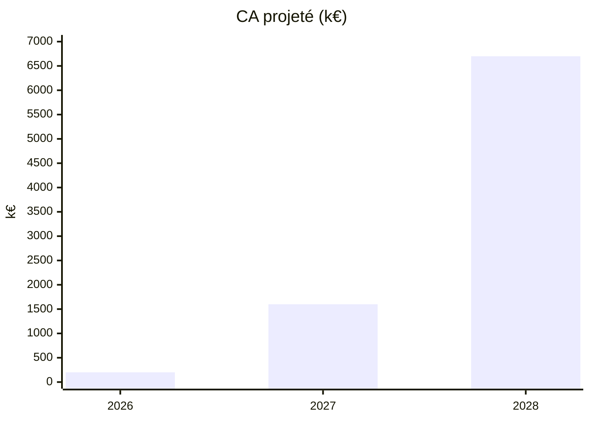

# 🎞️ Plan du PowerPoint — Pitch 7 min

> [!info] Règle d'or
> **Moins de 10 mots par slide**. La slide accompagne la parole, elle ne la remplace pas.

## 🗂️ Structure des slides (12 slides)

```mermaid
graph LR
    S1[1. Cover] --> S2[2. Problème]
    S2 --> S3[3. Solution]
    S3 --> S4[4. Démo 1]
    S4 --> S5[5. Démo 2]
    S5 --> S6[6. Différenciation]
    S6 --> S7[7. Marché]
    S7 --> S8[8. Business Model]
    S8 --> S9[9. Financier]
    S9 --> S10[10. Équipe + Roadmap]
    S10 --> S11[11. Ask]
    S11 --> S12[12. Slogan final]
```



## 🎨 Slide par slide

### Slide 1 — Cover · 5 s
- **Visuel** : ![[tangible-logo-vertical.png|160]] + slogan *« Ne louez plus votre passion. Possédez-la. »*
- **Sous-slogan EN discret** : *Don't rent your passion. Own it.*
- **Footer** : Scrum'Innov 2026 · équipe & date

### Slide 2 — Problème · 1 min
- **Titre** : *« Le film que j'avais acheté a disparu »*
- **Visuel** : capture « Film indisponible » + logos iTunes / Disney+ / Netflix barrés
- **Sous-titre** : *Microsoft Movies fermé. Disney+ retire. iTunes bloque.*
- **Chiffre clé** : « Acheter ≠ Posséder — 2021–2026 »

### Slide 3 — Solution · 40 s
- **Titre** : **Tangible**
- **Visuel** : 2 colonnes
  - 🎬 **Player** : media center local chiffré
  - 🛒 **Store** : achat = propriété certifiée
- **Pied de slide** : *« + marché de revente »*

### Slide 4 — Démo 1 (Bibliothèque + achat) · 50 s
- Screenshot du Player ([[Prototype et Maquettes|écran bibliothèque]])
- Screenshot de la page film Store avec bouton "Acheter définitivement"

### Slide 5 — Démo 2 (Certificat + revente) · 10 s
- Screenshot certificat de propriété
- Petite flèche → marché secondaire

### Slide 6 — Différenciation · 1 min
- **Tableau comparatif** (voir [[Veille Concurrentielle]]) :
```
                    Tangible  iTunes  Netflix  Jellyfin
Achat définitif        ✅       ⚠️      ❌        ❌
Téléchargement local   ✅       ⚠️      ❌        ✅
Certificat propriété   ✅       ❌      ❌        ❌
Revente possible       ✅       ❌      ❌        ❌
Boutique légale        ✅       ✅      ✅        ❌
```

### Slide 7 — Marché · 30 s
- Chiffre clé : **130 Mds €** marché vidéo mondial
- Fatigue abonnements : **3 abos / foyer · 300 €/an**
- **Opportunité** : niche propriété réelle sous-servie

### Slide 8 — Business Model · 1 min
- 4 revenus illustrés icônes :
  - 💰 Commission vente (20%)
  - ♻️ Commission revente (5%)
  - 🎫 Tangible Pass (8€/mois)
  - 🛠️ SDK B2B
- Split simple : Studio 70 / Tangible 20 / Seeders 10

### Slide 9 — Financier · 45 s
- Graphique (mermaid ou image) :

- Break-even : début 2028
- Ask : **950 k€** amorçage

### Slide 10 — Équipe & Roadmap · 45 s
- Photos/icônes équipe (3 parcours BUT Informatique)
- Timeline 24 mois très simple : MVP → Store → Marché → Scale

### Slide 11 — Ask · 30 s
- **950 k€** clairement indiqué
- Usage : Runway 12 mois, MVP Player, Store bêta, 5 000 users
- Contact : email + site

### Slide 12 — Slogan final · 5 s
- ![[tangible-logo-vertical.png|180]]
- **« Ne louez plus votre passion. Possédez-la. »**
- *Don't rent your passion. Own it.*
- Site / contact

## 🎨 Charte graphique des slides

| Élément | Valeur |
|---------|--------|
| Fond | `#1A1A2E` (anthracite) ou blanc selon slide |
| Titre | *Fraunces*, 44 pt, `#C9A96E` (or cuivré) |
| Corps | *Inter*, 24-28 pt, `#F5F1E8` |
| Accent / CTA | `#E63946` (rouge projecteur) |
| Logo | Toujours en bas à droite ou centré selon slide |

## ⏱️ Répétitions

- [ ] **Répétition 1** : seul, chronométré, lecture script
- [ ] **Répétition 2** : devant l'équipe, ajustements
- [ ] **Répétition 3** : conditions réelles, pas de notes
- [ ] **Répétition 4** : Q/R type — [[Objections et Réponses]]

## 🔗 Liens

- [[Script Pitch 7min]] · [[Objections et Réponses]]
- [[Prototype et Maquettes]] · [[Slogan et Identité]]
- [[MOC]]
