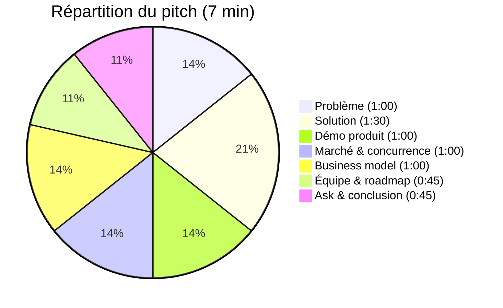

# 🎤 Script Pitch — 7 minutes

> [!important] Timing strict : **7 min**, vote jury + public
> Critères : **Originalité · Cohérence · Argumentation · Complétude**

## ⏱️ Découpage par minute

---

## 🎬 0:00 — 1:00 — Le Problème (HOOK)

> **« Samedi dernier, j'ai voulu revoir *The Matrix*. Je l'avais "acheté" sur iTunes en 2019. 15 €. Verdict : 'indisponible dans votre région'. Mon film a disparu.**
>
> **Parlons cash : quand on achète un film sur Netflix, Amazon, iTunes, on ne possède rien. On loue. Même quand on paie 15 € pour l'avoir "pour toujours".**
>
> **Résultat : Microsoft a arrêté de vendre des films en 2021 — leurs clients ont perdu leurs bibliothèques. Disney+ retire régulièrement des originaux. Et nous, spectateurs, on accepte ça. »**

→ Slide : capture écran « film retiré » + titre **ACHETER ≠ POSSÉDER**

---

## 💡 1:00 — 2:30 — La Solution : Tangible

> **« Tangible, c'est la première plateforme où acheter un film signifie vraiment le posséder.**
>
> **Concrètement, deux choses :**
>
> **👉 Un — Tangible Player. Un media center local, beau, premium, 4K HDR, Dolby Vision. Bibliothèque chiffrée. Fonctionne à 100% hors-ligne. Profils enfants sécurisés. Cast vers votre TV en un clic.**
>
> **👉 Deux — Tangible Store. Une boutique légale de films où chaque achat génère un certificat de propriété cryptographique. Vérifiable hors-ligne. Même si Tangible ferme demain, votre film reste, votre certificat reste.**
>
> **Et mieux : vous pouvez revendre votre licence. Avec des royalties automatiques pour les ayants droit. Une économie circulaire numérique. »**

→ Slide : Architecture simple (Player + Store + Certificat + Revente)

---

## 🎥 2:30 — 3:30 — Démo / Visuel

> **« Voici ce que ça donne... »**

→ **Démo ou capture vidéo** : parcours d'achat → téléchargement → lecture offline → certificat → mise en revente

Si pas de démo : montrer 3 screenshots clés ([[Prototype et Maquettes]]) :
1. Bibliothèque
2. Page film + bouton "Acheter définitivement"
3. Certificat de propriété

---

## 📊 3:30 — 4:30 — Marché & différenciation

> **« Le marché de la vidéo à domicile pèse 130 milliards d'euros. Le streaming croît, mais la lassitude aussi : 3 abonnements moyens par foyer, 300€/an, contenus qui disparaissent.**
>
> **Face à nous :**
> **— Netflix, Disney+ : vous ne possédez rien.**
> **— iTunes, Google Play : propriété fictive, DRM propriétaire, pas de revente.**
> **— Jellyfin, Plex : techniques, pas de boutique légale.**
>
> **Tangible est le seul à combiner media center local + boutique légale + propriété réelle + marché de revente. C'est unique. »**

→ Slide : Tableau différenciation (voir [[Veille Concurrentielle]])

---

## 💰 4:30 — 5:30 — Business Model

> **« Notre modèle repose sur 4 revenus :**
> **1. Commission de 20% sur chaque vente. Studio 70%, seeders P2P 10%, Tangible 20%.**
> **2. Commission de 5% sur la revente. Le vendeur garde 80%, l'ayant-droit reçoit 15%, nous 5%.**
> **3. Tangible Pass, optionnel à 8€/mois, pour un catalogue rotatif.**
> **4. Licence SDK B2B pour les studios et distributeurs tiers.**
>
> **Objectifs : 8 000 utilisateurs en Année 1 pour 200k€ de CA, 45 000 en Année 2 pour 1,6M€, et 150 000 en Année 3 pour 6,7M€. Break-even début 2028. »**

→ Slide : Graphique CA + mix de revenus

---

## 👥 5:30 — 6:15 — Équipe & roadmap

> **« Notre équipe : étudiants BUT Informatique, 3 parcours, compétences réparties : dev, sécurité, crypto, produit, growth.**
>
> **Notre roadmap : **
> **— Phase 1, 6 mois : MVP Player + 50 films indé.**
> **— Phase 2, 12 mois : Store + mobile + blockchain.**
> **— Phase 3, 24 mois : marché secondaire + studios majors + B2B.**
> **— Phase 4, scale international. »**

→ Slide : Timeline ([[Roadmap Technique]])

---

## 🎯 6:15 — 7:00 — Ask & conclusion

> **« Pour lancer Tangible, nous levons 950 000 € en amorçage : 500k€ seed, 450k€ prêts & BPI.**
>
> **Avec ça, 12 mois de runway, MVP Player livré, Store en bêta, 5 000 premiers utilisateurs.**
>
> **Mais au-delà de l'argent, nous construisons une conviction : que le numérique responsable passe par la propriété réelle. Moins de re-streaming, plus de pérennité. Moins de GAFAM, plus de souveraineté. Moins de location déguisée, plus d'honnêteté avec les utilisateurs.**
>
> **Tangible. Ne louez plus votre passion. Possédez-la. Merci. »**

→ Slide finale : Logo + slogan + contact

---

## 🎭 Conseils de livraison

- **Posture** : droite, ouverte, pas derrière l'ordi
- **Voix** : varier le rythme — lent sur le problème, énergique sur la solution
- **Regard** : balayer le jury, pas lire ses notes
- **Accroche émotionnelle** : l'anecdote Matrix doit être **vraie et sincère**
- **Storytelling** : problème concret → solution → preuve → futur
- **Ne jamais dépasser 7 min** — s'entraîner avec chrono 3× minimum

## ⚠️ Ce qu'il faut éviter

- ❌ Jargon technique non expliqué (TEE, AES, etc.) → à garder pour les questions
- ❌ Slides surchargées
- ❌ Lire ses notes
- ❌ Tonner sur la "révolution" — rester humble et précis
- ❌ Marketing superlatives ("blazing fast", "100% secure")

## 🔗 Liens

- [[Plan du PowerPoint]] · [[Objections et Réponses]]
- [[Critères Jury]] · [[Tangible - Description]]
- [[MOC]]
