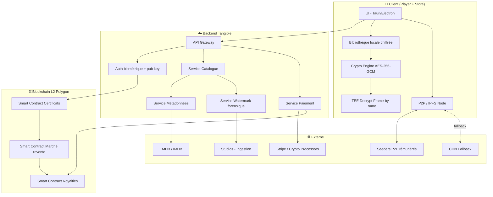
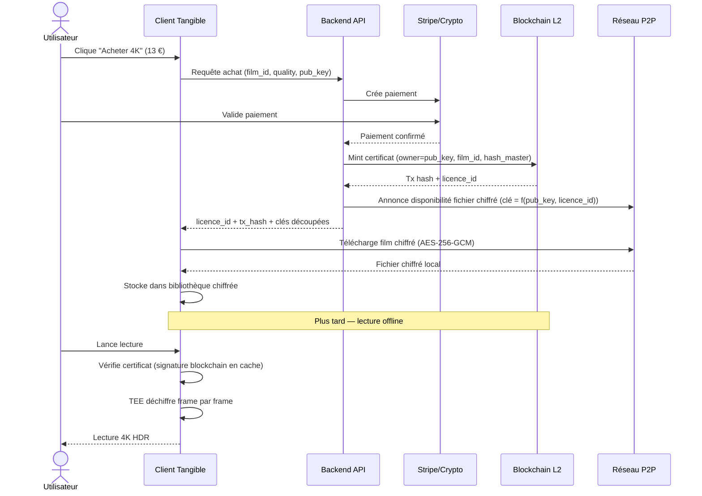
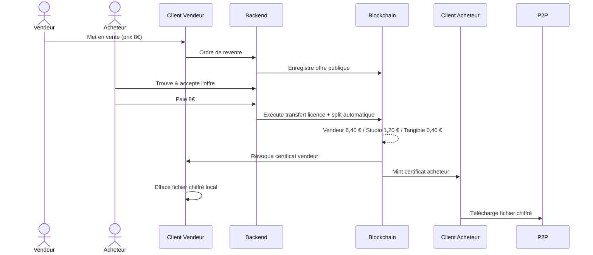
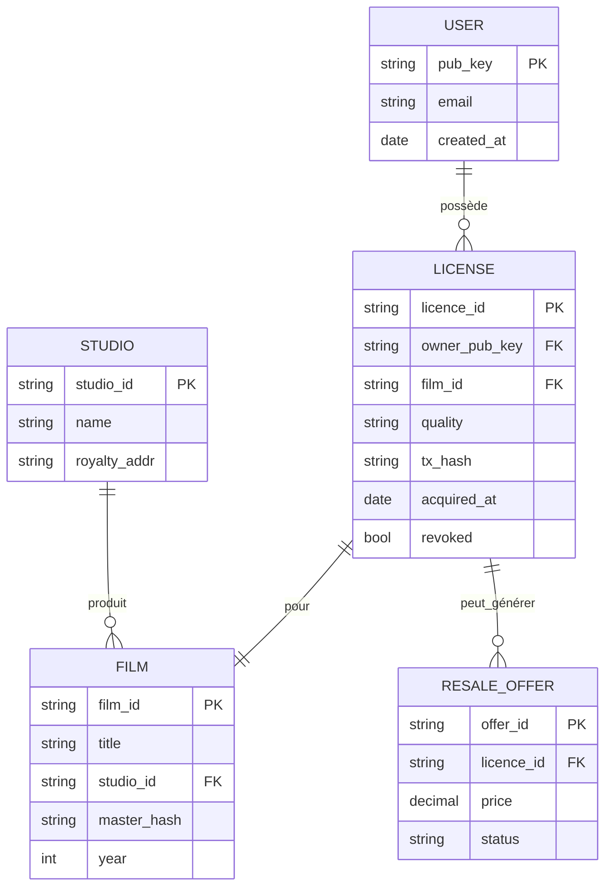

# 🏗️ Architecture Technique — Tangible

## 🗺️ Vue d'ensemble

## 🧱 Stack technique

### Client (Player + Store)

| Couche | Techno | Raison |
|--------|--------|--------|
| Desktop shell | **Tauri** (Rust + WebView) | Léger, sécurisé, multi-OS |
| Mobile | **React Native** / **Kotlin Multiplatform** | Code partagé iOS/Android |
| UI | **React / TypeScript** | Écosystème, productivité |
| Lecture vidéo | **libmpv** / **FFmpeg** | 4K HDR Dolby Vision, sous-titres |
| Cast | **libmicrodns**, **UPnP**, **AirPlay libs** | Chromecast/AirPlay/DLNA |
| Crypto | **libsodium**, **OpenSSL** (AES-256-GCM) | Standards audités |
| TEE | **Intel SGX**, **ARM TrustZone** (mobile) | Isolation hardware |
| P2P | **libp2p** / **IPFS** (go-ipfs embarqué) | Décentralisé, résilient |
| Stockage local | **SQLite** (chiffré avec SQLCipher) | Léger, fiable |

### Backend

| Couche | Techno | Raison |
|--------|--------|--------|
| API Gateway | **Go** (net/http + chi) | Performance, concurrence |
| Services | **Go** microservices | Découpe fonctionnelle |
| Base de données | **PostgreSQL** (principale) + **Redis** (cache) | Robustesse + vitesse |
| Message bus | **NATS** | Légèreté, performance |
| Auth | **OIDC + Webauthn** (biométrie) + clés publiques | Sans mot de passe |
| Stockage master | **S3** (chiffré) / **Filebase** (IPFS) | Hybride coût/perf |
| Watermarking | **FFmpeg** + pipeline proprio TEE | Marquage à la volée |
| Observability | **OpenTelemetry** + **Grafana** | Standard moderne |

### Blockchain

| Couche | Techno | Raison |
|--------|--------|--------|
| L2 | **Polygon PoS** | Coûts faibles, EVM-compatible |
| Smart contracts | **Solidity** + Foundry | Écosystème mature |
| Oracles | **Chainlink** | Prix crypto, données externes |
| Wallet users | **Account Abstraction** (ERC-4337) | UX sans seed phrase |

## 🔄 Flux d'un achat

## 🔁 Flux d'une revente (marché secondaire)

## 🧩 Modèle de données principal

## 🔗 Liens

- [[Sécurité]] · [[Roadmap Technique]]
- [[Tangible - Description]] · [[Prototype et Maquettes]]
- [[MOC]]
