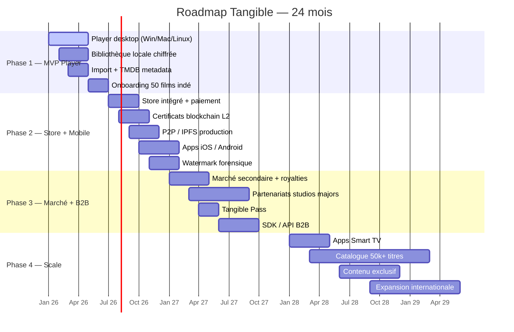
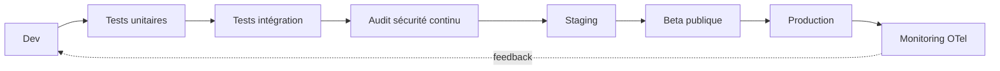

# 🛣️ Roadmap Technique — Tangible

## 🗺️ Vue d'ensemble

## 📍 Phase 1 — 0-6 mois — MVP Player

### Objectif
Un **player local premium** qui fait mieux que Jellyfin côté UX, avec une boutique initiale minimale.

### Livrables
- ✅ Player desktop **Windows / macOS / Linux** (Tauri)
- ✅ Bibliothèque locale **chiffrée** (AES-256-GCM, SQLCipher)
- ✅ Import fichiers existants + récupération métadonnées **TMDB**
- ✅ Authentification biométrique (Webauthn)
- ✅ Profils (dont enfants) + contrôle parental
- ✅ Lecture 4K HDR + sous-titres + multi-audio
- ✅ Cast Chromecast / AirPlay / DLNA
- ✅ Onboarding 50 films indépendants achetables en standalone
- ✅ Site vitrine + landing page

### Jalons techniques
- M+2 : Architecture crypto validée en audit
- M+4 : Alpha fermée (100 users)
- M+6 : Bêta publique + 50 films indé disponibles

## 📍 Phase 2 — 6-12 mois — Store + Mobile

### Objectif
Transformer l'outil local en **véritable plateforme de distribution**.

### Livrables
- 🛒 Store intégré avec paiement (CB + crypto)
- 🧾 Certificats de propriété on-chain (Polygon L2)
- 🌐 Réseau P2P / IPFS en production + fallback CDN
- 📱 Apps iOS + Android (React Native)
- 💧 Watermarking forensique frame-level en TEE
- 🔐 Programme bug bounty public

### Jalons techniques
- M+9 : Smart contracts audités
- M+10 : Premier achat on-chain en prod
- M+12 : 5 000 utilisateurs actifs

## 📍 Phase 3 — 12-24 mois — Marché + B2B

### Objectif
Activer les **relais de croissance** : revente, studios majors, B2B.

### Livrables
- ♻️ Marché secondaire + royalties automatiques
- 🎬 Signatures studios majors (au moins 2 sur 5 visés)
- 🎫 Tangible Pass (abonnement optionnel)
- 🛠️ SDK / API B2B pour distributeurs et plateformes tierces
- 📊 Dashboard ayants droit (stats en temps réel)

### Jalons
- M+18 : Revente fonctionnelle + 100 transactions/semaine
- M+20 : 1ère major signée
- M+24 : 50 000 utilisateurs actifs, ARR > 1 M€

## 📍 Phase 4 — 24+ mois — Scale

### Objectif
Passer **mainstream** et **international**.

### Livrables
- 📺 Apps Smart TV (Samsung Tizen, LG webOS, Android TV)
- 📚 Catalogue 50 000+ titres
- 🎞️ Contenu exclusif (acquisitions, docs, indé premium)
- 🌍 Expansion internationale (UE → US → Asie)

## 🔄 Pipeline de release

## 🔗 Liens

- [[Architecture Technique]] · [[Sécurité]]
- [[Tangible - Description]] · [[Hypothèses Financières]]
- [[MOC]]
