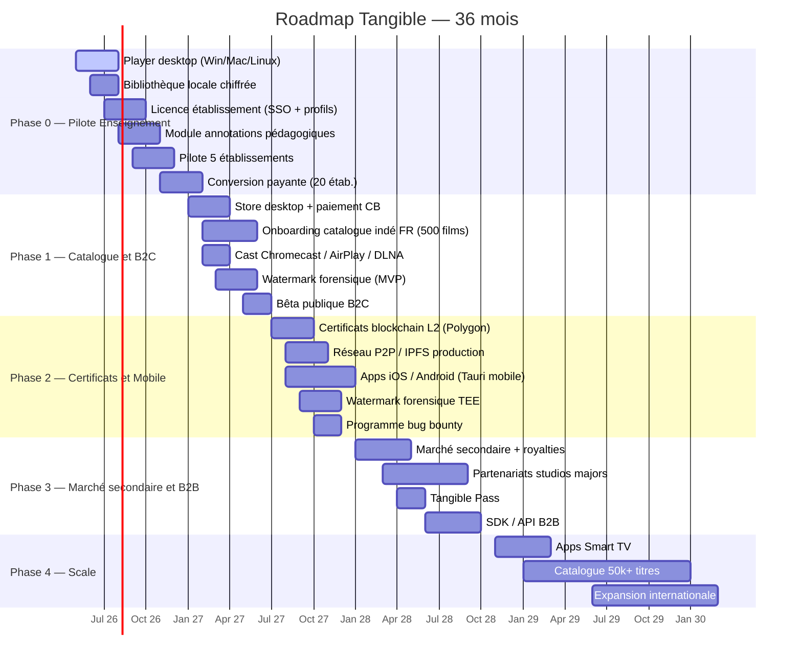
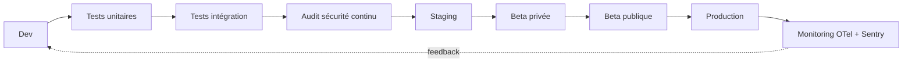

# 🛣️ Roadmap Technique — Tangible

> [!tldr] Stratégie d'exécution
> **Phase 0** : atterrissage sur la niche enseignement (cf. [[Niches et Go-To-Market]]) — 9 mois pour prouver le modèle.
> **Phase 1** : extension catalogue et ouverture B2C cinéphile — 6 mois.
> **Phase 2-3** : monétisation complète (Store, blockchain, mobile, majors) — 18 mois.
> **Phase 4** : scale mainstream et international — 12+ mois.

## 🗺️ Vue d'ensemble 36 mois

## 📍 Phase 0 — Mois 0-9 — Pilote Enseignement

> Voir [[Niches et Go-To-Market]] pour la stratégie commerciale.

### Objectif
Prouver la **traction B2B éducation** avec 20 établissements payants et 150 k€ ARR avant d'attaquer le grand public.

### Livrables techniques

#### Module 1 — Player desktop minimum (M+0 → M+4)
- Tauri 2 (Rust + Web) pour Windows, macOS, Linux
- Bibliothèque locale chiffrée **AES-256-GCM** + SQLCipher
- Import fichiers existants + récupération métadonnées **TMDB**
- Lecture 4K HDR, sous-titres SRT/VTT/ASS, multi-audio
- Profils utilisateur (dont profils enseignants)
- Authentification biométrique (WebAuthn)

#### Module 2 — Licence établissement (M+2 → M+5)
- SSO SAML / OIDC (intégration ENT, rectorats, universités)
- Domaines email whitelistés par établissement
- Provisioning SCIM pour profils en masse
- Certificat de licence vérifiable offline (JWT signé + horodatage)
- Dashboard admin établissement (usage, films consultés, renouvellements)

#### Module 3 — Annotations pédagogiques (M+4 → M+7)
- Chapitrage enseignant (définir séquences pour TD)
- Notes temporisées (commentaire sur un timecode)
- Comparaison 2 plans côte à côte (split screen)
- Export séquence courte (≤ 30 s pour citation pédagogique, watermarké)
- Partage de notes entre profils d'un même établissement

#### Module 4 — Onboarding catalogue éducatif (M+5 → M+9)
- 50 films catalogue de démarrage (10 domaine public restaurés + 40 négociés)
- Fiches pédagogiques pré-remplies (niveau, programme, objectifs)
- Mapping avec programmes officiels Education Nationale (fonctionnalité v2)

### Jalons de validation

| Mois | Critère technique | Critère business |
|---|---|---|
| M+2 | Architecture crypto auditée (cabinet externe) | 3 lettres d'intérêt établissement |
| M+4 | Alpha fermée — 20 users internes | Contact formel ADAV + Canopé |
| M+6 | Bêta pilote — 5 établissements | 1er contrat pilote gratuit signé |
| M+9 | v1.0 stable + annotations | **20 établissements payants, ARR ≥ 100 k€** |

### Stack technique Phase 0
- **Front player** : Tauri 2 + React 19 + Vite, Redux Toolkit pour l'état
- **Backend player** : Rust (crypto, file I/O, vidéo pipeline GStreamer/FFmpeg)
- **Backend SaaS** (licences, métadonnées) : Go + PostgreSQL + Redis
- **SSO** : Keycloak ou Auth0 selon coût
- **Infra** : Scaleway (FR, RGPD) + Cloudflare R2 pour fichiers sources
- **CI/CD** : GitHub Actions + signature binaires (Apple notarization, Windows SmartScreen)

### Go/No-Go M+9
Voir critères [[Niches et Go-To-Market#📌 Critères de décision « on persiste ou on pivote »]].

## 📍 Phase 1 — Mois 9-15 — Catalogue et B2C cinéphile

### Objectif
Ouvrir le **B2C** avec un catalogue crédible (500+ films indé) et la fonctionnalité Store complète.

### Livrables techniques
- 🛒 **Store intégré** : paiement CB via Stripe, paiement crypto via Ramp (option)
- 🎞️ Onboarding catalogue indé FR (Diaphana, Ad Vitam, Haut et Court, Pyramide, Le Pacte, Memento)
- 🌐 Cast **Chromecast / AirPlay / DLNA**
- 💧 Watermark forensique MVP (CPU, visible en analyse frame)
- 📢 Site vitrine B2C + SEO (« Netflix a retiré X », comparatifs)
- 📩 Newsletter nouveautés + Discord communautaire

### Jalons
- M+12 : Store en prod, 1er achat B2C
- M+13 : 500 films disponibles à l'achat
- M+15 : **5 000 utilisateurs actifs B2C + 40 établissements B2B**

### Levée Série A
Ouverture dossier à M+10, cible 3-5 M€ à closer M+15 pour financer Phase 2.

## 📍 Phase 2 — Mois 15-24 — Certificats et Mobile

### Objectif
Transformer Tangible en **plateforme de propriété** avec certificats blockchain et apps mobiles.

### Livrables techniques
- ⛓️ Certificats de propriété **on-chain Polygon L2** (smart contracts audités)
- 🌐 Réseau **P2P / IPFS** en production (coord CDN Cloudflare + seeders incentivés)
- 📱 Apps **iOS + Android** (Tauri mobile ou React Native selon perf)
- 💧 **Watermarking forensique en TEE** (frame-level, imperceptible)
- 🔐 Programme bug bounty public (HackerOne ou Intigriti)
- 🔄 Migration progressive des users Phase 0-1 vers certificats on-chain

### Jalons
- M+18 : Smart contracts audités (Trail of Bits ou Least Authority)
- M+20 : 1er achat on-chain en prod
- M+22 : Apps iOS + Android sur stores
- M+24 : **25 000 utilisateurs actifs + 100 établissements + 1 M€ ARR**

## 📍 Phase 3 — Mois 24-36 — Marché secondaire et B2B

### Objectif
Activer les **relais de croissance** : revente, studios majors, SDK distributeur.

### Livrables techniques
- ♻️ **Marché secondaire** : revente P2P avec royalties automatiques aux ayants droit (typiquement 10-20 % du prix de revente)
- 🎫 **Tangible Pass** : abonnement optionnel pour remises + accès anticipé
- 🛠️ **SDK / API B2B** : permettre à des distributeurs tiers (cinémas, festivals) d'utiliser la couche propriété Tangible
- 📊 Dashboard **ayants droit** (stats temps réel, revenus, territoires)
- 🎬 Intégration catalogue majors (Studiocanal en priorité)

### Jalons business
- M+28 : Marché secondaire en prod, 100+ reventes/semaine
- M+30 : 1ère major signée (Studiocanal visé)
- M+36 : **50 000 utilisateurs + 300 établissements + ARR > 3 M€**

## 📍 Phase 4 — Mois 36+ — Scale mainstream et international

### Objectif
Passer **grand public** et **international**.

### Livrables
- 📺 Apps **Smart TV** (Samsung Tizen, LG webOS, Android TV)
- 📚 Catalogue **50 000+ titres** (majors US + catalogue international)
- 🌍 Expansion UE (DE, ES, IT) → US → Asie
- 🎞️ Contenu **exclusif** (acquisitions, docs indé, restaurations)
- 🏫 Programme **Tangible Campus** international

## 🔄 Pipeline de release

### Cadence
- **Patches** (fix sécurité) : < 48 h
- **Mineures** : toutes les 2 semaines
- **Majeures** : tous les trimestres

## 📦 Dépendances externes critiques

| Dépendance | Risque | Mitigation |
|---|---|---|
| Polygon L2 disponibilité | ★★ | Abstraction du layer blockchain, fallback Arbitrum |
| Apple notarization | ★★ | Process validé Phase 0, compte Enterprise |
| Catalogue distributeurs | ★★★ | Voir [[Partenaires Potentiels]] — 3 sources alternatives par segment |
| Audit sécurité | ★★★ | Pré-réserver créneau 6 mois avant |
| Subventions CNC / BPI | ★★ | Dossiers lancés dès M+3 |

## 🔗 Liens

- [[Architecture Technique]] · [[Sécurité]]
- [[Niches et Go-To-Market]] · [[Partenaires Potentiels]]
- [[Tangible - Description]] · [[Hypothèses Financières]]
- [[Cases 2 - Activités Partenaires Ressources Canaux]]
- [[MOC]]
