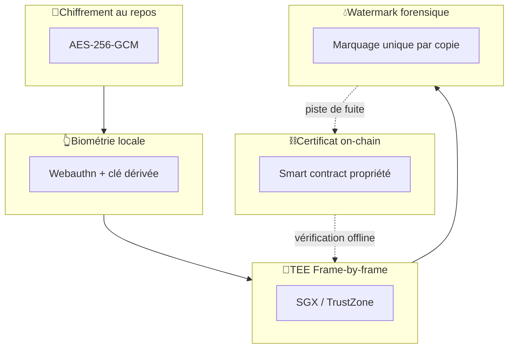
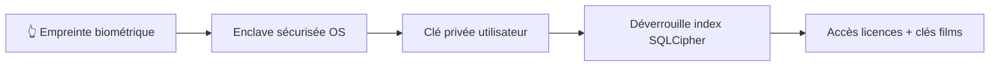
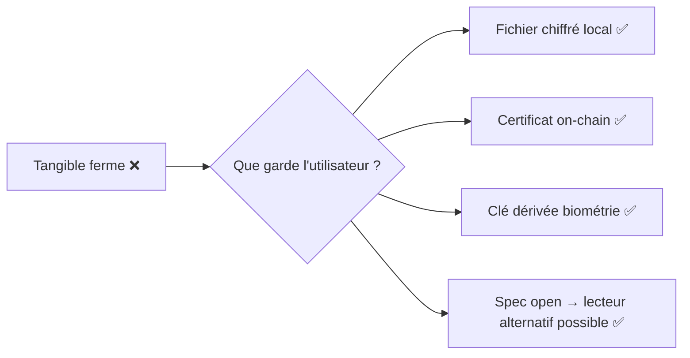
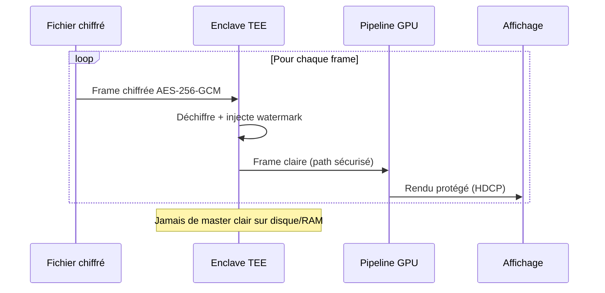

# 🛡️ Sécurité — Les 5 couches Tangible

> [!important]
> La sécurité est un **argument de vente central** : elle garantit à la fois la propriété utilisateur et les droits des ayants droit.

## 🏰 Vue d'ensemble des 5 couches

## 1️⃣ Chiffrement AES-256-GCM des fichiers

- Chaque film est **chiffré côté serveur** avant distribution
- Clé de chiffrement propre à **chaque licence** (pas de clé partagée globalement)
- **AES-256-GCM** = confidentialité + authentification (détecte la moindre altération)
- Distribué chiffré sur P2P → fichier seul inutilisable sans clé

## 2️⃣ Biométrie locale

- Authentification via **Webauthn** (Face ID, Touch ID, Windows Hello, FIDO2)
- Une **clé privée** est dérivée et scellée par l'enclave biométrique
- Cette clé déverrouille l'**index chiffré** de la bibliothèque
- Jamais de mot de passe stocké ni transmis

## 3️⃣ Certificat de propriété on-chain

- Chaque achat mint un **certificat (NFT non-transférable par défaut, sauf revente)** sur Polygon L2
- Contient : `owner_pub_key`, `film_id`, `hash_master`, `quality`, `timestamp`
- **Vérifiable offline** via cache local signé cryptographiquement
- Le certificat = **preuve de propriété** même si Tangible ferme
- **Open standard** → un tiers peut développer un lecteur compatible si nécessaire

### Résistance à la disparition de Tangible

## 4️⃣ TEE — Déchiffrement frame-by-frame

- Utilisation d'**Intel SGX** (desktop) ou **ARM TrustZone** (mobile)
- Le film **entier n'est jamais déchiffré en RAM** en clair
- Chaque **frame** (ou segment de quelques secondes) est déchiffrée dans l'enclave et envoyée au pipeline graphique
- Empêche le screen-scraping mémoire et la copie d'un master déchiffré

## 5️⃣ Watermark forensique frame-level

- Lors de la lecture, **chaque frame est marquée** avec un watermark imperceptible contenant `licence_id`
- Le marquage est **différent pour chaque copie** : si une version du film fuite en ligne, on identifie **quelle licence** a servi de source
- Technique : modulation de coefficients DCT + LSB imperceptible, robuste à recompression
- Recours possible : révocation de la licence + déclenchement procédure légale

## 🚨 Modèle de menace

| Attaquant | Objectif | Défense Tangible |
|-----------|----------|------------------|
| Utilisateur malveillant | Copier/pirater le film | TEE + watermark (traçabilité) |
| Hacker externe | Voler la DB users | Webauthn sans mot de passe + chiffrement bout-en-bout |
| État de surveillance | Tracer la consommation | Pas de tracking, certificats pseudonymes |
| Tangible corrompu | Révoquer abusivement une licence | Certificat on-chain, preuve indépendante |
| Concurrent | Cloner la plateforme | Catalogue + communauté + OSS partiel |

## 🔒 Conformité & certifications visées

- ✅ RGPD (données minimales, droit à l'oubli)
- ✅ Audit annuel indépendant (ex. Quarkslab, Synacktiv)
- ✅ Bug bounty public (HackerOne / YesWeHack)
- 🎯 ISO 27001 cible Année 2
- 🎯 Certification ANSSI cible Année 3 (marché public / souveraineté)

## 🔗 Liens

- [[Architecture Technique]] · [[Roadmap Technique]]
- [[Tangible - Description]] · [[Objections et Réponses]]
- [[MOC]]
