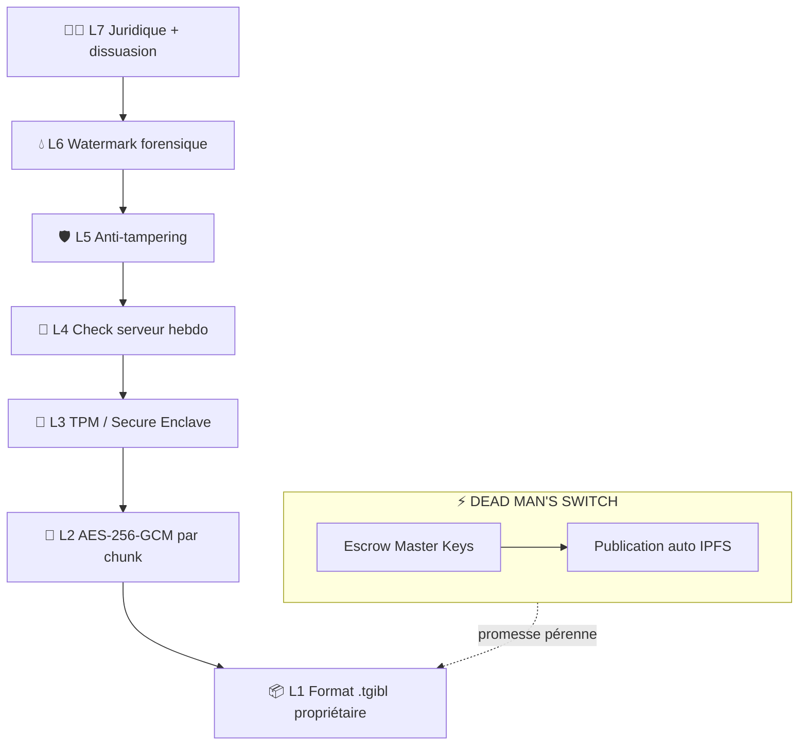
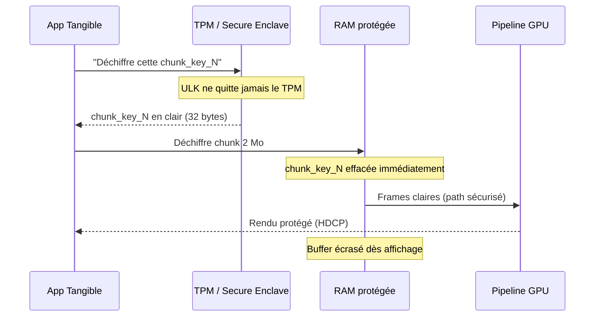
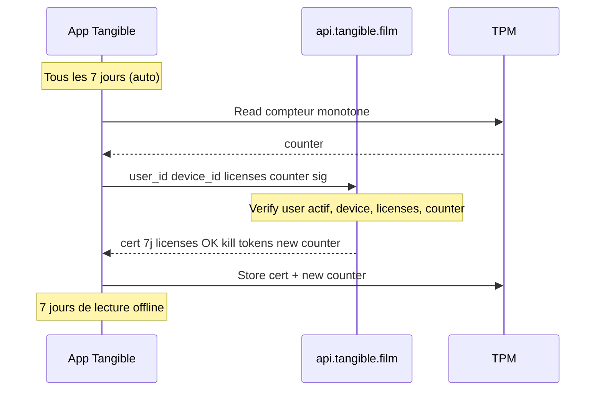
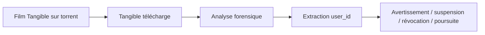
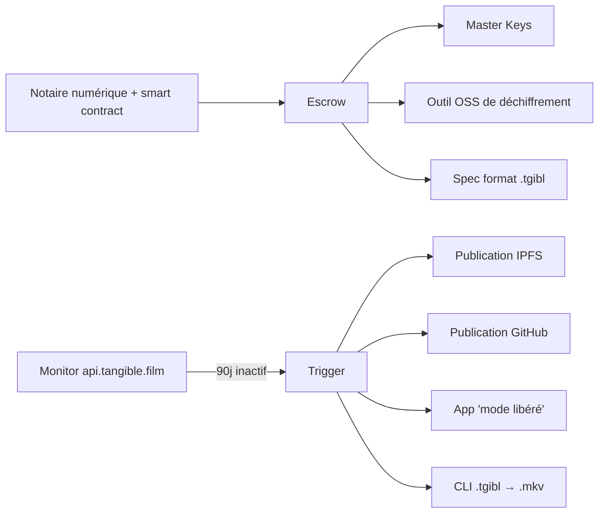

# 🔒 Architecture sécurité Tangible

> [!important] La sécurité est un argument de vente central
> Elle garantit à la fois la **propriété réelle** de l'utilisateur et les **droits des ayants droit** — plus la **promesse "pour toujours"** même si Tangible ferme (Dead Man's Switch).

## 🏰 Vue d'ensemble — 7 couches + DMS

```
╔══════════════════════════════════════════════════════════════╗
║                                                              ║
║  COUCHE 7 — Juridique & Dissuasion                           ║
║  COUCHE 6 — Traçabilité (Watermark forensique)               ║
║  COUCHE 5 — Protection de l'app (Anti-tampering)             ║
║  COUCHE 4 — Vérification serveur (Check hebdo)               ║
║  COUCHE 3 — Stockage des clés (TPM / Secure Enclave)         ║
║  COUCHE 2 — Chiffrement du fichier (AES-256-GCM)             ║
║  COUCHE 1 — Format propriétaire (.tgibl)                     ║
║                                                              ║
║  ⚡ DEAD MAN'S SWITCH — Garantie post-fermeture              ║
║                                                              ║
╚══════════════════════════════════════════════════════════════╝
```



---

## 1️⃣ Couche 1 — Format propriétaire `.tgibl`

**But** : le fichier est **inutile sans l'écosystème**.

### Structure du fichier `.tgibl`

```
┌──────────────────────────────────────────────┐
│ HEADER (non chiffré, 4 Ko)                   │
│ ├── Magic bytes : "TGIBL1"                   │
│ ├── Version du format                        │
│ ├── Film ID (hash)                           │
│ ├── License ID (hash)                        │
│ ├── Chunk count                              │
│ ├── Codec utilisé (H.265 / AV1)              │
│ ├── Résolution / bitrate                     │
│ ├── Message clair : "Téléchargez             │
│ │   Tangible sur tangible.film"              │
│ └── Signature du header (Ed25519)            │
├──────────────────────────────────────────────┤
│ MANIFEST CHIFFRÉ (variable)                  │
│ ├── Table des chunks                         │
│ ├── Hash SHA-256 de chaque chunk             │
│ ├── Offset / taille de chaque chunk          │
│ └── Metadata du film (titre, cover, etc)     │
├──────────────────────────────────────────────┤
│ CHUNK 0 (2 Mo) — chiffré AES-256-GCM         │
│ CHUNK 1 (2 Mo) — chiffré AES-256-GCM         │
│ CHUNK 2 (2 Mo) — chiffré AES-256-GCM         │
│ …                                            │
│ CHUNK N                                      │
└──────────────────────────────────────────────┘
```

### Résultat
- ❌ VLC, MPC, FFmpeg ne peuvent rien lire
- ❌ Renommer en `.mp4` ne marche pas
- ❌ Hex editor → bruit chiffré
- ✅ Seule l'app Tangible peut l'ouvrir

**Difficulté** : ⭐ Facile

---

## 2️⃣ Couche 2 — Chiffrement AES-256-GCM par chunk

**But** : même si on accède au fichier brut, c'est illisible.

### Processus de chiffrement (côté serveur à l'achat)

```
Film master (H.265)
      ↓
Watermark forensique unique pour cet user
      ↓
Découpe en chunks de 2 Mo
      ↓
Pour chaque chunk N :
├── chunk_key_N = HKDF-SHA256(ULK, salt=N)
├── nonce_N = unique par chunk
└── encrypted_chunk_N = AES-256-GCM(chunk_key_N, nonce_N, data)
      ↓
Fichier .tgibl assemblé
```

**Où** :
- **ULK** = User License Key (unique par user × film)
- **HKDF** = dérivation de clé standardisée (RFC 5869)
- **AES-256-GCM** = chiffrement authentifié (confidentialité + intégrité)

### Pourquoi par chunk ?
- **Streaming** : déchiffrement à la volée, pas besoin de tout en RAM
- **Robustesse** : un chunk corrompu n'affecte que lui
- **Seek rapide** : aller à 1h32 sans déchiffrer depuis 0
- **RAM minimale** : buffer 4-6 Mo max

**Difficulté** : ⭐⭐ Moyen — libsodium, OpenSSL

---

## 3️⃣ Couche 3 — Stockage sécurisé des clés (TPM / Secure Enclave)

**But** : la ULK n'est **jamais exposée en clair** au système.

### Par plateforme

| OS | Hardware | API |
|----|----------|-----|
| **Windows** | TPM 2.0 + Windows Hello | CNG (Crypto Next Gen) |
| **macOS** | Secure Enclave (T2/M1+) | Security Framework |
| **iOS** | Secure Enclave | Keychain + kSecAttrToken |
| **Android** | StrongBox / TEE | Android Keystore |
| **Linux** | TPM 2.0 (sinon LUKS fallback) | tpm2-tss |

### Ce qui est dans le hardware sécurisé
- ULK par film
- Device Key (identifie ce device)
- Certificat hebdomadaire signé
- Compteur monotone (anti-retour de date)

### Propriété clé
> [!tip] **La ULK est non-extractible**
> L'app peut **demander** au TPM de déchiffrer, mais ne peut **pas lire** la ULK elle-même. Même reverse-engineered, la ULK ne fuit pas.

### Flow réel de déchiffrement



### Nuance importante
Le TPM déchiffre la `chunk_key_N` (32 bytes, rapide), **pas** le chunk de 2 Mo (trop lent à 30fps). Le chunk passe par la RAM, mais :
- Marqué `MADV_DONTDUMP` / `VirtualLock`
- Effacé via `memset_s` après usage
- Jamais le film entier en RAM simultanément

**Difficulté** : ⭐⭐⭐ Avancé — API spécifique par OS

---

## 4️⃣ Couche 4 — Vérification serveur (Check hebdo)

**But** : révoquer l'accès si revente, invalider comptes volés.

### Flow



### Payload envoyé (<1 Ko)
- `user_id`, `device_id`
- Liste `license_ids`
- Compteur monotone actuel
- Signature par device key

### Réponse signée (<2 Ko)
- **Certificat** Ed25519 valide 7 jours
- Liste licences OK
- **Kill tokens** si revente
- Nouveau compteur monotone
- Timestamp serveur

### Dégradation offline

| Jours sans connexion | Comportement |
|---------------------|--------------|
| J+1 à J+7 | Normal |
| J+8 à J+9 | Bandeau discret "connectez-vous" |
| J+10 à J+14 | Popup non bloquant, lecture OK |
| J+14+ | **Lecture bloquée**, message clair |

### Anti-triche date
- Compteur monotone dans le TPM (ne peut qu'incrémenter)
- Si date système < dernier timestamp → refus
- Impossible de "remonter l'horloge"

**Difficulté** : ⭐⭐ Moyen — API REST

---

## 5️⃣ Couche 5 — Protection de l'app (Anti-tampering)

**But** : empêcher reverse engineering et modification.

### A. Obfuscation du code
- **Code natif C++/Rust** (pas de bytecode décompilable)
- Obfuscation des symboles
- **Control flow flattening**
- **String encryption** (pas de `check_license` en clair)

### B. Détection d'environnement hostile
- **Debugger** : `ptrace`, `IsDebuggerPresent`
- **VM** (VMware, VirtualBox, QEMU) → dégradation 4K → 720p
- **Hooking** (Frida, Xposed, dynamic instrumentation)
- **Screen capture actif** (OBS, Shadowplay) → pause ou écran noir
- **Intégrité binaire** : hash au lancement + signature code (Authenticode / Apple Notarization)

### C. Protection mémoire
- Chunks déchiffrés : `MADV_DONTDUMP` / `VirtualLock`
- Effacement immédiat : `memset_s`
- Clés éphémères sur mémoire protégée spéciale (pas heap classique)
- **Guard pages** autour des buffers sensibles

### D. Protection de la sortie vidéo
- **HDCP détection** → si non-HDCP, max 720p ou refus
- **Chemin vidéo protégé** :
  - Windows : Hardware DRM path (DXVA + PMP)
  - macOS : VideoToolbox + FairPlay path
  - Android : MediaCodec + secure surface
  - iOS : AVFoundation (protégé nativement)
- **Watermark overlay** juste avant affichage GPU

### Outils
- **Arxan / Irdeto** (protection commerciale d'apps)
- **DexGuard** (Android) / **iXGuard** (iOS)
- Custom C++/Rust pour desktop

**Difficulté** : ⭐⭐⭐⭐ Difficile — expertise sécurité nécessaire

---

## 6️⃣ Couche 6 — Watermark forensique

**But** : si tout échoue, **tracer la fuite**.

### Principe
Chaque copie est **unique par utilisateur**. Modifications **invisibles à l'œil nu** :
- Micro-décalages de pixels (±1 valeur)
- Micro-ajustements de timing entre frames
- Patterns spectraux dans l'audio

### Résistance
- ✅ Recompression (x264, x265, HandBrake)
- ✅ Downscale (4K → 1080p → 720p)
- ✅ Crop / rotation légère
- ✅ Capture d'écran (cam-rip, screen record)
- ✅ Changement de codec

### Procédure en cas de fuite



### Watermark custom vs commercial

| Solution | Coût | Robustesse | Utilisé par |
|----------|:----:|:----------:|-------------|
| **NexGuard / NAGRA** | Élevé (licences) | Ultra robuste | Disney+, Netflix 4K |
| **Custom** (spread spectrum, OpenStego) | Faible | Suffisant | Recommandé pour commencer |

**Difficulté** : ⭐⭐⭐ Avancé — solutions clé en main existantes

---

## 7️⃣ Couche 7 — Juridique & Dissuasion

**But** : dernière ligne de défense, **l'humain**.

### CGU / Conditions d'achat
- « Vous achetez une licence de visionnage personnel »
- « Le partage du fichier est interdit »
- « Le watermark permet l'identification »
- « Toute fuite → suspension + poursuites »
- « Revente exclusivement via Tangible »
- Conformité DMCA / directive européenne droit d'auteur

### Dissuasion visible dans l'app
> Au premier lancement d'un film :
>
> « Ce film vous est attribué personnellement et contient un watermark invisible. Il est protégé par [loi applicable]. »

Pas menaçant, factuel. Suffit à dissuader l'utilisateur moyen.

**Difficulté** : ⭐ Facile — avocat spécialisé

---

## ⚡ Dead Man's Switch — Garantie post-fermeture

> [!important] La promesse « pour toujours » — contractuellement tenable.

### Préparation dès le lancement



### Condition de déclenchement
**Si `api.tangible.film` ne répond plus pendant 90 jours consécutifs**.

### Déclenchement automatique
1. Publication des **Master Keys** sur IPFS (permanent, décentralisé)
2. Publication sur GitHub
3. L'app détecte l'absence de serveur :
   - Télécharge les Master Keys
   - Mode **"libéré"** : lecture sans check
   - OU : outil CLI pour convertir `.tgibl` → `.mkv`

### Résultat
- Les films deviennent **DRM-free**
- La promesse "vos films pour toujours" = **tenue**

---

## 📊 Tableau récapitulatif

| Couche | Mesure | Difficulté | Bloque qui ? |
|:------:|--------|:----------:|--------------|
| 1 | Format `.tgibl` propriétaire | ⭐ | 100 % des users sans l'app |
| 2 | AES-256-GCM par chunk | ⭐⭐ | 99,9 % — incassable sans la clé |
| 3 | TPM / Secure Enclave | ⭐⭐⭐ | 99 % — la clé ne quitte pas le HW |
| 4 | Check hebdo serveur | ⭐⭐ | Revente fraudeuse + comptes volés |
| 5 | Anti-tampering | ⭐⭐⭐⭐ | 95 % — reverse engineers |
| 6 | Watermark forensique | ⭐⭐⭐ | Personne (traçage APRÈS la fuite) |
| 7 | Juridique | ⭐ | Users honnêtes + dissuasion |
| **DMS** | Dead Man's Switch | ⭐⭐ | **Garantie si fermeture** |

---

## 🎯 Ce que ça donne en pratique

| Profil | Ce qui se passe |
|--------|-----------------|
| **User normal** (99 %) | Achète, ouvre l'app, regarde. Aucune friction. Ne peut pas copier/partager même s'il le voulait. |
| **User curieux** (hex editor) | Voit du bruit chiffré. Abandonne. |
| **Pirate amateur** (reverse basique) | Anti-debug, obfuscation, TPM. Abandonne. |
| **Pirate expert** (0,01 %) | Pourrait extraire un film. Mais watermark le trace. Effort/récompense : pas rentable. |
| **Si Tangible ferme** | DMS → films libérés automatiquement. Promesse tenue. |

## 💡 Positionnement

C'est **réaliste, implémentable, et au niveau des standards de l'industrie** — voire au-dessus grâce au **watermark + Dead Man's Switch**. Aucune de ces couches n'est de la science-fiction : **technologies existantes et éprouvées**.

## 🔗 Liens

- [[Architecture Technique]] · [[Roadmap Technique]]
- [[Tangible - Description]] · [[Objections et Réponses]]
- [[MOC]]
