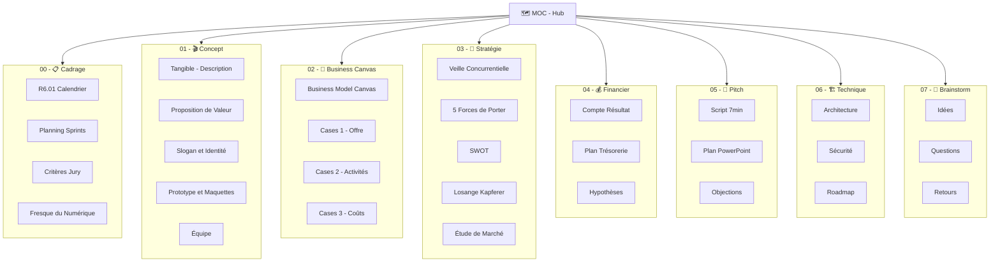
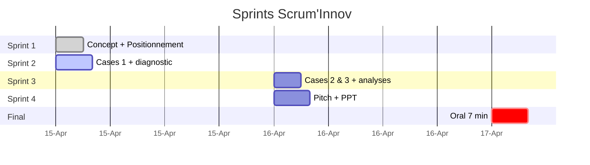

# 🗺️ MOC — Hub central du vault Tangible

![[tangible-logo-horizontal.png|400]]

> [!quote] **Tangible — Ne louez plus votre passion. Possédez-la.**
> *Don't rent your passion. Own it.*
> La plateforme qui redonne aux spectateurs la propriété réelle de leurs films numériques.

## 🧭 Carte du vault

## 📋 00 — Cadrage du TD

- [[R6.01 - Calendrier et Contenu]] — les 4 sprints, les 4 livrables
- [[Planning Sprints]] — planning détaillé
- [[Critères Jury]] — originalité, cohérence, argumentation, complétude
- [[Fresque du Numérique]] — mapping Tangible ↔ axes Fresque (argument jury)

## 🎬 01 — Concept

- [[Tangible - Description]] — description complète du projet
- [[Proposition de Valeur]] — value prop canonique
- [[Slogan et Identité]] — slogan *« Ne louez plus votre passion. Possédez-la. »*, logos, palette
- [[Prototype et Maquettes]] — wireframes des écrans clés
- [[Équipe]] — fondateurs, rôles, advisors, rampup 25 ETP

## 🌐 Site vitrine (livrable 1)

- [[site-vitrine/README|README site vitrine]] — HTML/CSS complet prêt à présenter

## 🧩 02 — Business Model Canvas

- [[Business Model Canvas]] — vue synoptique des 9 cases
- [[Cases 1 - Offre Relation Segments]] — Livrable 1
- [[Cases 2 - Activités Partenaires Ressources Canaux]] — Livrable 2
- [[Cases 3 - Coûts et Revenus]] — Livrable 3

## 🎯 03 — Analyse stratégique

- [[Veille Concurrentielle]] — iTunes, Netflix, Jellyfin…
- [[5 Forces de Porter]] — intensité 3,8/5
- [[SWOT]] — TOWS intégré
- [[Losange de Kapferer]] — Qui / Contre qui / Pourquoi / Quand
- [[Étude de Marché]] — TAM/SAM/SOM + 4 personas chiffrés + protocole sondage

## 💰 04 — Financier

- [[Compte de Résultat Prévisionnel]] — An N + projection N+1, N+2
- [[Plan de Trésorerie 3 ans]]
- [[Hypothèses Financières]] — bases d'argumentation chiffrée

## 🎤 05 — Pitch

- [[Script Pitch 7min]] — découpage minute par minute
- [[Plan du PowerPoint]] — 12 slides
- [[Objections et Réponses]] — 20 Q/R anticipées

## 🏗️ 06 — Technique

- [[Architecture Technique]] — stack, flux, modèle données
- [[Sécurité]] — 5 couches, modèle de menace
- [[Roadmap Technique]] — Gantt 24 mois

## 💭 07 — Brainstorm

- [[Idées en vrac]] — toutes les pistes
- [[Questions ouvertes]] — à trancher
- [[Retours et Itérations]] — journal des feedbacks

## 🗓️ Progression sprints

## ✅ Checklist des livrables

### Livrable 1 (Sprint 1-2)
- [x] Visuel concept + slogan → [[Slogan et Identité]]
- [x] Cases 1 BC → [[Cases 1 - Offre Relation Segments]]
- [x] Losange Kapferer → [[Losange de Kapferer]]
- [x] Page d'accueil site vitrine → [[Prototype et Maquettes]]

### Livrable 2 (Sprint 3)
- [x] Cases 2 BC → [[Cases 2 - Activités Partenaires Ressources Canaux]]
- [x] SWOT → [[SWOT]]
- [x] Porter → [[5 Forces de Porter]]

### Livrable 3 (Sprint 3)
- [x] Cases 3 BC → [[Cases 3 - Coûts et Revenus]]
- [x] Compte de résultat → [[Compte de Résultat Prévisionnel]]
- [x] Trésorerie 3 ans → [[Plan de Trésorerie 3 ans]]

### Livrable 4 (Sprint 4 + J+1)
- [x] Script pitch → [[Script Pitch 7min]]
- [x] Plan PowerPoint → [[Plan du PowerPoint]]
- [x] Objections → [[Objections et Réponses]]
- [ ] Répétitions chronométrées (×4)

## 🏷️ Tags utiles

- `#sprint-1` / `#sprint-2` / `#sprint-3` / `#sprint-4`
- `#livrable-1` / `#livrable-2` / `#livrable-3` / `#livrable-4`
- `#priorité/haute` / `#priorité/moyenne` / `#priorité/basse`
- `#statut/brouillon` / `#statut/en-cours` / `#statut/terminé`
